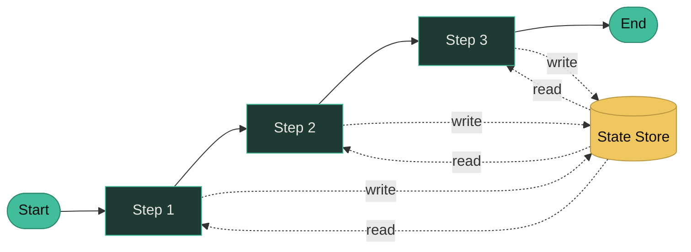

# Durable Execution

---
layout: default
---

# What is Durable Execution?

Durable Execution enables code to run to completion even if the process that runs the code fails. A new process will pick up where the previous one left off.

- **Automatic State Persistence** - Workflow state is automatically checkpointed
- **Replay Mechanism** - Deterministic re-execution

---
layout: default
---

# Why Durable Execution Matters for AI Agents

- **Resume from Last Checkpoint** - Not from the start of the workflow
- **Save on LLM Costs** - No re-execution of expensive calls
- **Predictable Behavior** - Deterministic execution
- **Built-in Observability** - Full execution history
- **Built-in Resiliency** - Automatic retry logic