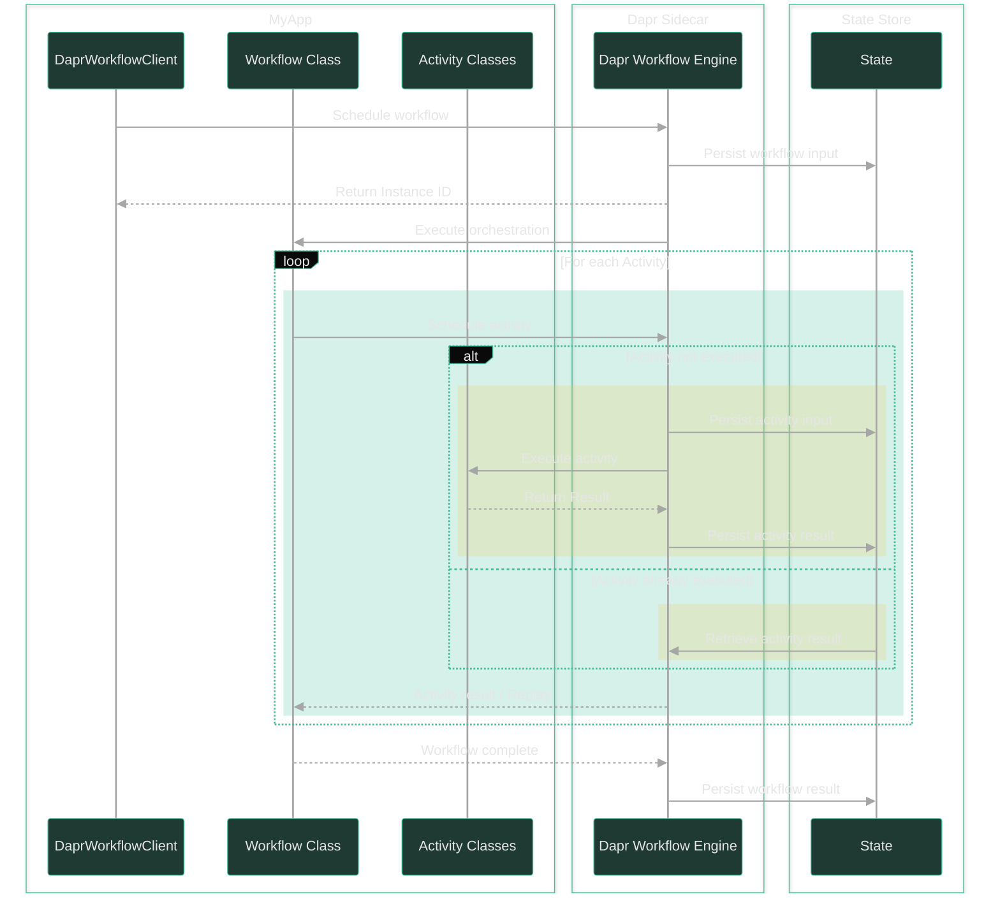

# Workflow Sequence Diagram

```mermaid
%%{init: {"theme":"base","themeVariables":{"background":"#0a0a0a","primaryColor":"#1f3a32","primaryTextColor":"#e6e6e6","primaryBorderColor":"#41BD9B","lineColor":"#A6A6A6","secondaryColor":"#111315","tertiaryColor":"#111315","clusterBkg":"#111315","clusterBorder":"#41BD9B","titleColor":"#F0C75E","edgeLabelBackground":"#0a0a0a","noteBkgColor":"#111315","noteTextColor":"#e6e6e6","noteBorderColor":"#41BD9B","actorBkg":"#1f3a32","actorBorder":"#41BD9B","actorTextColor":"#e6e6e6","actorLineColor":"#A6A6A6","signalColor":"#A6A6A6","signalTextColor":"#e6e6e6","labelBoxBkgColor":"#0a0a0a","labelBoxBorderColor":"#41BD9B","labelTextColor":"#e6e6e6","loopTextColor":"#e6e6e6","altSectionBkgColor":"#111315","sectionBkgColor":"#111315","fontFamily":"Geist,sans-serif"}}}%%
sequenceDiagram
    box MyApp
        participant Client as DaprWorkflowClient
        participant Workflow as Workflow Class
        participant Activity as Activity Classes
    end
    box Dapr Sidecar
        participant Engine as Dapr Workflow Engine
    end
    box State Store 
        participant State as State
    end

    Client->>Engine: Schedule workflow
    Engine->>State: Persist workflow input
    Engine-->>Client: Return Instance ID
    Engine->>Workflow: Execute orchestration
    loop For each Activity
        rect rgba(65, 189, 155, 0.22)
            Workflow->>Engine: Schedule activity
            alt Activity not executed
                rect rgba(240, 199, 94, 0.22)
                    Engine->>State: Persist activity input
                    Engine->>Activity: Execute activity
                    Activity-->>Engine: Return Result
                    Engine->>State: Persist activity result
                end
            else Activity already executed
                rect rgba(240, 199, 94, 0.22)
                    State->>Engine: Retrieve activity result
                end
            end
            Engine-->>Workflow: Activity result / Replay
        end
    end
    Workflow-->>Engine: Workflow complete
    Engine->>State: Persist workflow result
```
