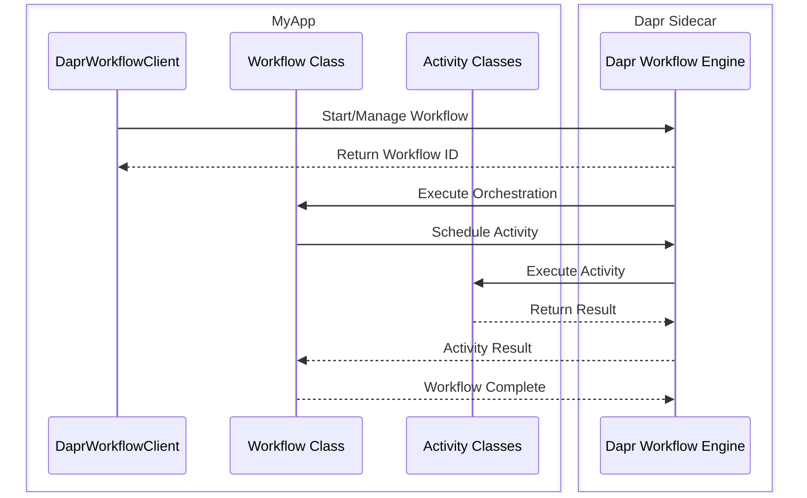

# Workflow Sequence Diagram

```mermaid
sequenceDiagram
    box MyApp
        participant Client as DaprWorkflowClient
        participant Workflow as Workflow Class
        participant Activity as Activity Classes
    end
    box Dapr Sidecar
        participant Engine as Dapr Workflow Engine
    end

    Client->>Engine: Start/Manage Workflow
    Engine-->>Client: Return Workflow ID
    Engine->>Workflow: Execute Orchestration
    Workflow->>Engine: Schedule Activity
    Engine->>Activity: Execute Activity
    Activity-->>Engine: Return Result
    Engine-->>Workflow: Activity Result
    Workflow-->>Engine: Workflow Complete
```
