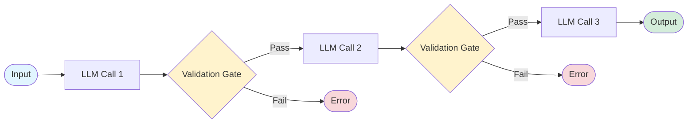

# Prompt Chaining Diagram

```mermaid
graph LR
    Start([Input]) --> A1[LLM Call 1]
    A1 --> Gate1{Validation Gate}
    Gate1 -->|Pass| A2[LLM Call 2]
    Gate1 -->|Fail| Fail1([Error])
    A2 --> Gate2{Validation Gate}
    Gate2 -->|Pass| A3[LLM Call 3]
    Gate2 -->|Fail| Fail2([Error])
    A3 --> End([Output])
    
    style Start fill:#e1f5ff
    style End fill:#d4edda
    style Fail1 fill:#f8d7da
    style Fail2 fill:#f8d7da
    style Gate1 fill:#fff3cd
    style Gate2 fill:#fff3cd
```

