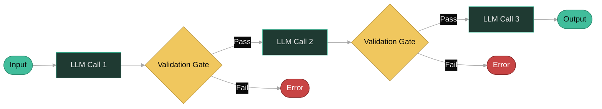

# Prompt Chaining Diagram

```mermaid
%%{init: {"theme":"base","themeVariables":{"background":"#0a0a0a","primaryColor":"#1f3a32","primaryTextColor":"#e6e6e6","primaryBorderColor":"#41BD9B","lineColor":"#A6A6A6","secondaryColor":"#111315","tertiaryColor":"#111315","clusterBkg":"#111315","clusterBorder":"#41BD9B","titleColor":"#F0C75E","edgeLabelBackground":"#0a0a0a","noteBkgColor":"#111315","noteTextColor":"#e6e6e6","noteBorderColor":"#41BD9B","actorBkg":"#1f3a32","actorBorder":"#41BD9B","actorTextColor":"#e6e6e6","actorLineColor":"#A6A6A6","signalColor":"#A6A6A6","signalTextColor":"#e6e6e6","labelBoxBkgColor":"#0a0a0a","labelBoxBorderColor":"#41BD9B","labelTextColor":"#e6e6e6","loopTextColor":"#e6e6e6","altSectionBkgColor":"#111315","sectionBkgColor":"#111315","fontFamily":"Geist,sans-serif"}}}%%
graph LR
    Start([Input]) --> A1[LLM Call 1]
    A1 --> Gate1{Validation Gate}
    Gate1 -->|Pass| A2[LLM Call 2]
    Gate1 -->|Fail| Fail1([Error])
    A2 --> Gate2{Validation Gate}
    Gate2 -->|Pass| A3[LLM Call 3]
    Gate2 -->|Fail| Fail2([Error])
    A3 --> End([Output])
    
    style Start fill:#41BD9B,stroke:#2d8a70,color:#0a0a0a
    style End fill:#41BD9B,stroke:#2d8a70,color:#0a0a0a
    style Fail1 fill:#c84444,stroke:#8a2a2a,color:#ffffff
    style Fail2 fill:#c84444,stroke:#8a2a2a,color:#ffffff
    style Gate1 fill:#F0C75E,stroke:#b8943f,color:#0a0a0a
    style Gate2 fill:#F0C75E,stroke:#b8943f,color:#0a0a0a
```

