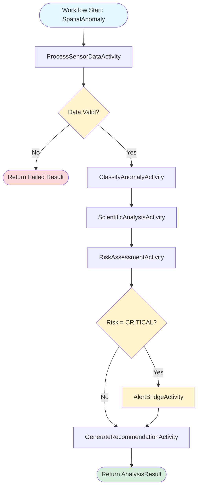

# Demo: Spatial Anomaly Analysis System - Prompt Chaining Pattern

```mermaid
graph TD
    Start([Workflow Start: SpatialAnomaly]) --> A1[ProcessSensorDataActivity]
    A1 --> Gate1{Data Valid?}
    Gate1 -->|No| Fail([Return Failed Result])
    Gate1 -->|Yes| A2[ClassifyAnomalyActivity]
    A2 --> A3[ScientificAnalysisActivity]
    A3 --> A4[RiskAssessmentActivity]
    A4 --> Gate2{Risk = CRITICAL?}
    Gate2 -->|Yes| Alert[AlertBridgeActivity]
    Gate2 -->|No| A5[GenerateRecommendationActivity]
    Alert --> A5
    A5 --> End([Return AnalysisResult])
    
    style Start fill:#e1f5ff
    style End fill:#d4edda
    style Fail fill:#f8d7da
    style Alert fill:#fff3cd
    style Gate1 fill:#fff3cd
    style Gate2 fill:#fff3cd
```