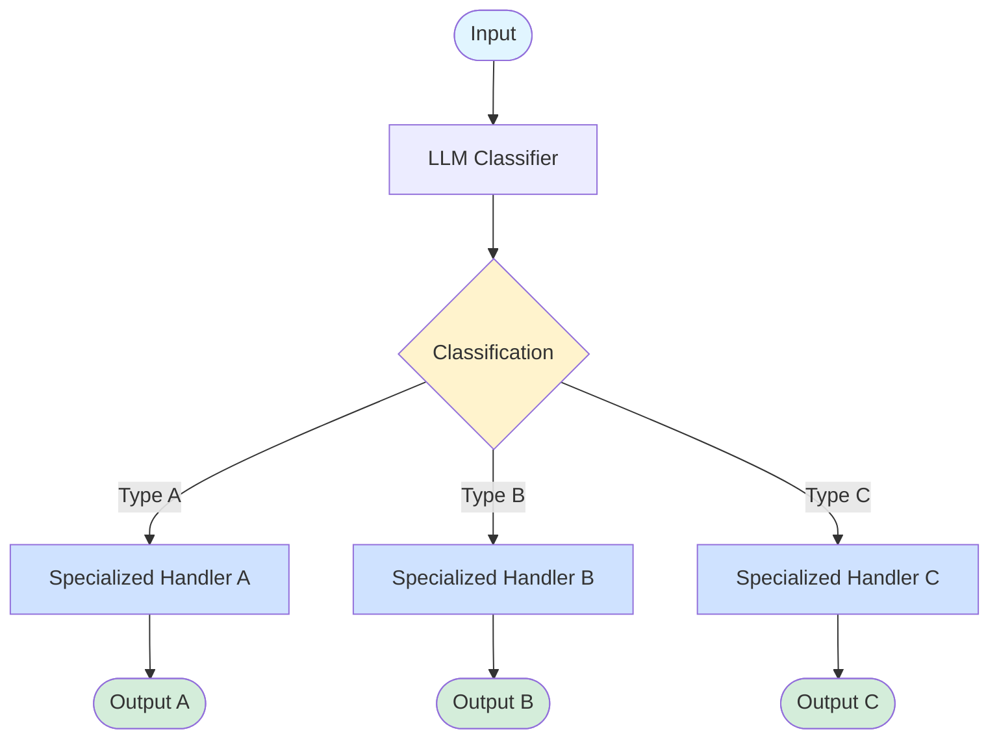

## Routing Diagram

```mermaid
graph TD
    Start([Input]) --> A1[LLM Classifier]
    A1 --> Router{Classification}
    Router -->|Type A| A2[Specialized Handler A]
    Router -->|Type B| A3[Specialized Handler B]
    Router -->|Type C| A4[Specialized Handler C]
    A2 --> End1([Output A])
    A3 --> End2([Output B])
    A4 --> End3([Output C])
    
    style Start fill:#e1f5ff
    style Router fill:#fff3cd
    style A2 fill:#cfe2ff
    style A3 fill:#cfe2ff
    style A4 fill:#cfe2ff
    style End1 fill:#d4edda
    style End2 fill:#d4edda
    style End3 fill:#d4edda
```
