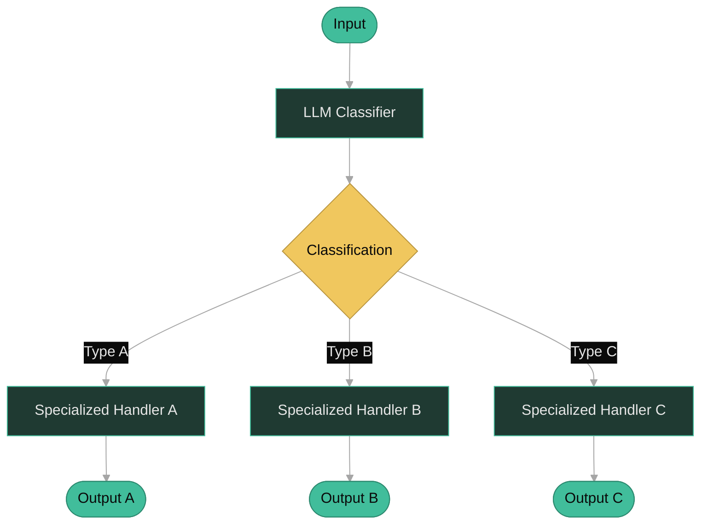

# Routing Diagram

```mermaid
%%{init: {"theme":"base","themeVariables":{"background":"#0a0a0a","primaryColor":"#1f3a32","primaryTextColor":"#e6e6e6","primaryBorderColor":"#41BD9B","lineColor":"#A6A6A6","secondaryColor":"#111315","tertiaryColor":"#111315","clusterBkg":"#111315","clusterBorder":"#41BD9B","titleColor":"#F0C75E","edgeLabelBackground":"#0a0a0a","noteBkgColor":"#111315","noteTextColor":"#e6e6e6","noteBorderColor":"#41BD9B","actorBkg":"#1f3a32","actorBorder":"#41BD9B","actorTextColor":"#e6e6e6","actorLineColor":"#A6A6A6","signalColor":"#A6A6A6","signalTextColor":"#e6e6e6","labelBoxBkgColor":"#0a0a0a","labelBoxBorderColor":"#41BD9B","labelTextColor":"#e6e6e6","loopTextColor":"#e6e6e6","altSectionBkgColor":"#111315","sectionBkgColor":"#111315","fontFamily":"Geist,sans-serif"}}}%%
graph TD
    Start([Input]) --> A1[LLM Classifier]
    A1 --> Router{Classification}
    Router -->|Type A| A2[Specialized Handler A]
    Router -->|Type B| A3[Specialized Handler B]
    Router -->|Type C| A4[Specialized Handler C]
    A2 --> End1([Output A])
    A3 --> End2([Output B])
    A4 --> End3([Output C])
    
    style Start fill:#41BD9B,stroke:#2d8a70,color:#0a0a0a
    style Router fill:#F0C75E,stroke:#b8943f,color:#0a0a0a
    style A2 fill:#1f3a32,stroke:#41BD9B,color:#e6e6e6
    style A3 fill:#1f3a32,stroke:#41BD9B,color:#e6e6e6
    style A4 fill:#1f3a32,stroke:#41BD9B,color:#e6e6e6
    style End1 fill:#41BD9B,stroke:#2d8a70,color:#0a0a0a
    style End2 fill:#41BD9B,stroke:#2d8a70,color:#0a0a0a
    style End3 fill:#41BD9B,stroke:#2d8a70,color:#0a0a0a
```

---

Pros & cons

- 🟢 Specialized handlers per category
- 🟢 Cost optimization (route to appropriate model)
- 🔴 Classification accuracy depends on routing decision

