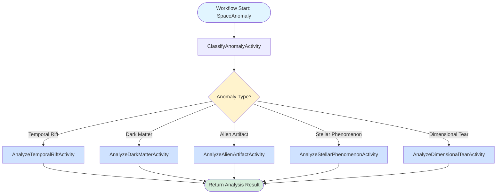

# Demo: Galactic Anomaly Classifier - Routing Pattern

```mermaid
graph TD
    Start([Workflow Start: SpaceAnomaly]) --> A1[ClassifyAnomalyActivity]
    A1 --> Router{Anomaly Type?}
    Router -->|Temporal Rift| A2[AnalyzeTemporalRiftActivity]
    Router -->|Dark Matter| A3[AnalyzeDarkMatterActivity]
    Router -->|Alien Artifact| A4[AnalyzeAlienArtifactActivity]
    Router -->|Stellar Phenomenon| A5[AnalyzeStellarPhenomenonActivity]
    Router -->|Dimensional Tear| A6[AnalyzeDimensionalTearActivity]
    A2 --> End([Return Analysis Result])
    A3 --> End
    A4 --> End
    A5 --> End
    A6 --> End
    
    style Start fill:#e1f5ff
    style End fill:#d4edda
    style Router fill:#fff3cd
    style A2 fill:#cfe2ff
    style A3 fill:#cfe2ff
    style A4 fill:#cfe2ff
    style A5 fill:#cfe2ff
    style A6 fill:#cfe2ff
```