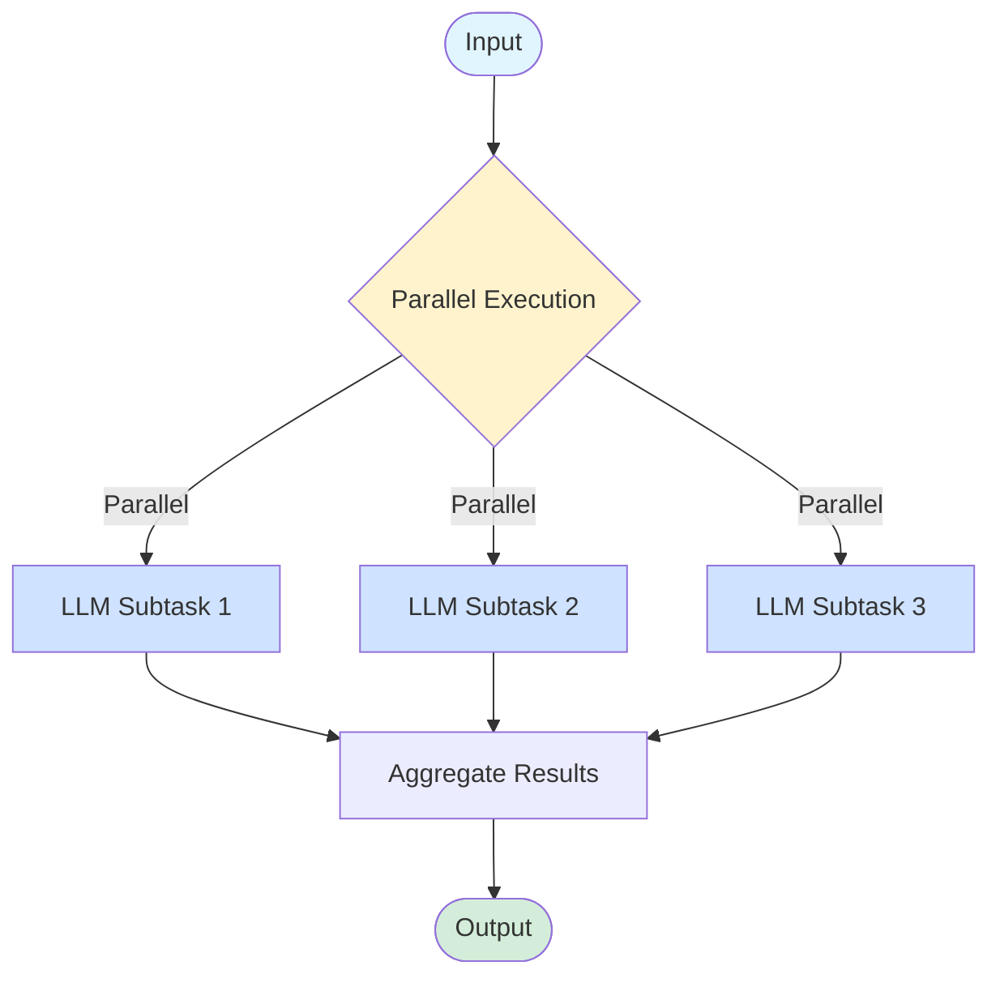

## Parallelization Diagrams

### Sectioning

```mermaid
graph TD
    Start([Input]) --> Parallel{Parallel Execution}
    Parallel -->|Parallel| A1[LLM Subtask 1]
    Parallel -->|Parallel| A2[LLM Subtask 2]
    Parallel -->|Parallel| A3[LLM Subtask 3]
    A1 --> Gather[Aggregate Results]
    A2 --> Gather
    A3 --> Gather
    Gather --> End([Output])
    
    style Start fill:#e1f5ff
    style Parallel fill:#fff3cd
    style A1 fill:#cfe2ff
    style A2 fill:#cfe2ff
    style A3 fill:#cfe2ff
    style End fill:#d4edda
```

### Use Cases

- Multi-source analysis
- Guardrails (process + screen)
- Code review with voting
