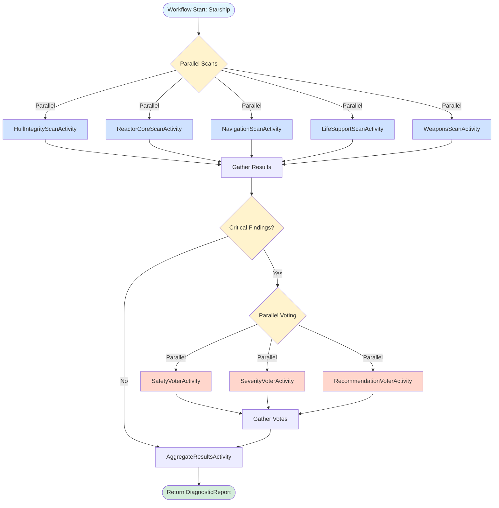

# Demo: Starship Diagnostics - Parallelization Pattern

```mermaid
graph TD
    Start([Workflow Start: Starship]) --> Parallel{Parallel Scans}
    Parallel -->|Parallel| S1[HullIntegrityScanActivity]
    Parallel -->|Parallel| S2[ReactorCoreScanActivity]
    Parallel -->|Parallel| S3[NavigationScanActivity]
    Parallel -->|Parallel| S4[LifeSupportScanActivity]
    Parallel -->|Parallel| S5[WeaponsScanActivity]
    S1 --> Gather[Gather Results]
    S2 --> Gather
    S3 --> Gather
    S4 --> Gather
    S5 --> Gather
    Gather --> Gate{Critical Findings?}
    Gate -->|Yes| Vote{Parallel Voting}
    Gate -->|No| Aggregate[AggregateResultsActivity]
    Vote -->|Parallel| V1[SafetyVoterActivity]
    Vote -->|Parallel| V2[SeverityVoterActivity]
    Vote -->|Parallel| V3[RecommendationVoterActivity]
    V1 --> GatherVotes[Gather Votes]
    V2 --> GatherVotes
    V3 --> GatherVotes
    GatherVotes --> Aggregate
    Aggregate --> End([Return DiagnosticReport])
    
    style Start fill:#e1f5ff
    style End fill:#d4edda
    style Parallel fill:#fff3cd
    style Gate fill:#fff3cd
    style Vote fill:#fff3cd
    style S1 fill:#cfe2ff
    style S2 fill:#cfe2ff
    style S3 fill:#cfe2ff
    style S4 fill:#cfe2ff
    style S5 fill:#cfe2ff
    style V1 fill:#ffd6cc
    style V2 fill:#ffd6cc
    style V3 fill:#ffd6cc
```