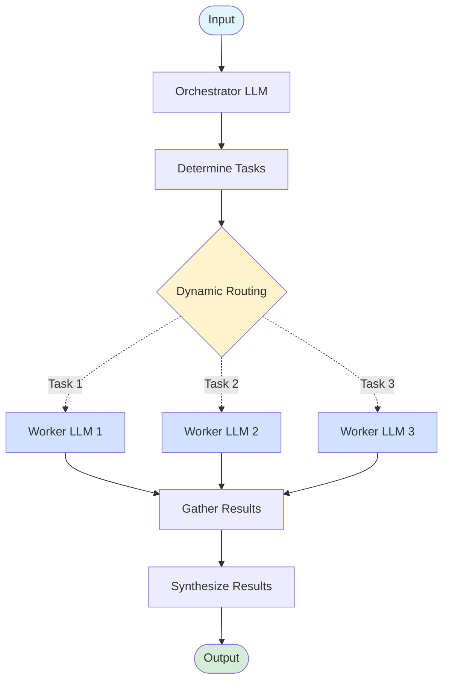

## Orchestrator-Workers Diagram

```mermaid
graph TD
    Start([Input]) --> A1[Orchestrator LLM]
    A1 --> A2[Determine Tasks]
    A2 --> Router{Dynamic Routing}
    Router -.->|Task 1| W1[Worker LLM 1]
    Router -.->|Task 2| W2[Worker LLM 2]
    Router -.->|Task 3| W3[Worker LLM 3]
    W1 --> Gather[Gather Results]
    W2 --> Gather
    W3 --> Gather
    Gather --> A3[Synthesize Results]
    A3 --> End([Output])
    
    style Start fill:#e1f5ff
    style Router fill:#fff3cd
    style W1 fill:#cfe2ff
    style W2 fill:#cfe2ff
    style W3 fill:#cfe2ff
    style End fill:#d4edda
```

### Use Cases

- Coding products (multi-file changes)
- Research tasks
- Complex planning
