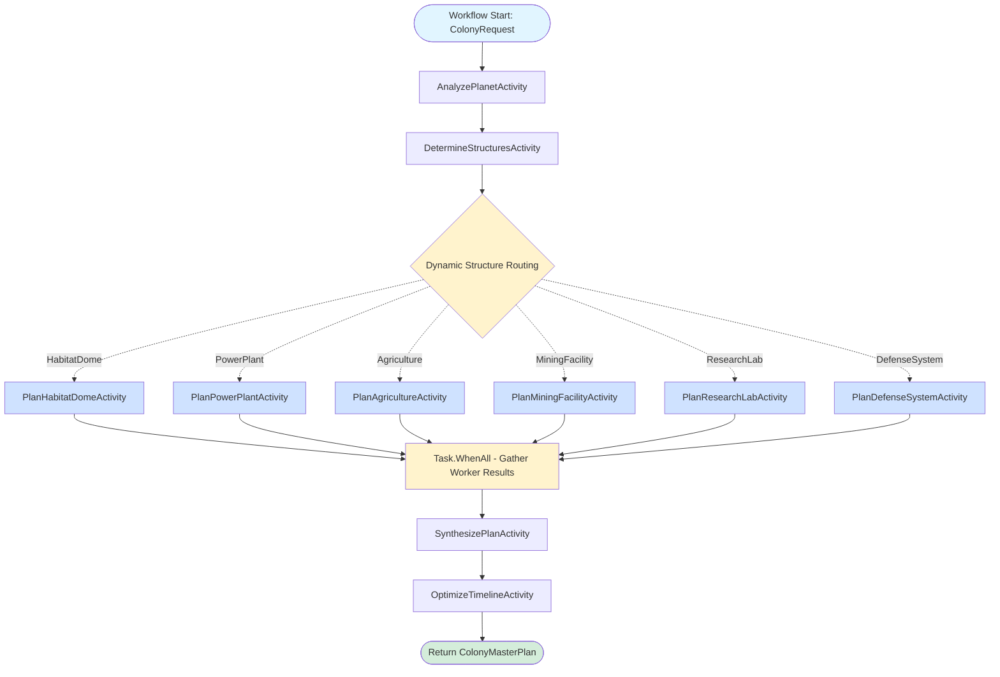

# Demo: Space Colony Planner - Orchestrator-Worker Pattern

```mermaid
graph TD
    Start([Workflow Start: ColonyRequest]) --> A1[AnalyzePlanetActivity]
    A1 --> A2[DetermineStructuresActivity]
    A2 --> Router{Dynamic Structure Routing}
    Router -.->|HabitatDome| W1[PlanHabitatDomeActivity]
    Router -.->|PowerPlant| W2[PlanPowerPlantActivity]
    Router -.->|Agriculture| W3[PlanAgricultureActivity]
    Router -.->|MiningFacility| W4[PlanMiningFacilityActivity]
    Router -.->|ResearchLab| W5[PlanResearchLabActivity]
    Router -.->|DefenseSystem| W6[PlanDefenseSystemActivity]
    W1 --> Gather[Task.WhenAll - Gather Worker Results]
    W2 --> Gather
    W3 --> Gather
    W4 --> Gather
    W5 --> Gather
    W6 --> Gather
    Gather --> A3[SynthesizePlanActivity]
    A3 --> A4[OptimizeTimelineActivity]
    A4 --> End([Return ColonyMasterPlan])
    
    style Start fill:#e1f5ff
    style End fill:#d4edda
    style Router fill:#fff3cd
    style Gather fill:#fff3cd
    style W1 fill:#cfe2ff
    style W2 fill:#cfe2ff
    style W3 fill:#cfe2ff
    style W4 fill:#cfe2ff
    style W5 fill:#cfe2ff
    style W6 fill:#cfe2ff
```