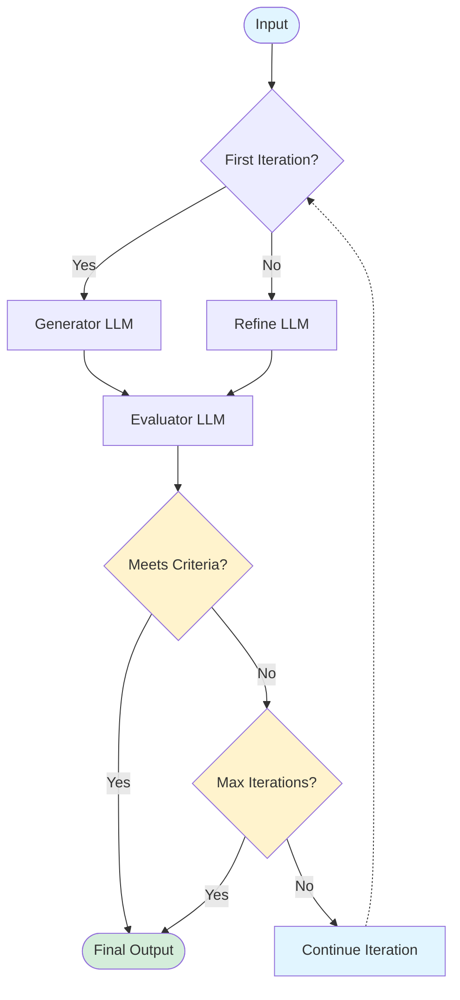

# Evaluator-Optimizer Diagram

```mermaid
graph TD
    Start([Input]) --> Check1{First Iteration?}
    Check1 -->|Yes| A1[Generator LLM]
    Check1 -->|No| A3[Refine LLM]
    A1 --> A2[Evaluator LLM]
    A3 --> A2
    A2 --> Gate{Meets Criteria?}
    Gate -->|Yes| End([Final Output])
    Gate -->|No| Gate2{Max Iterations?}
    Gate2 -->|Yes| End
    Gate2 -->|No| Restart[Continue Iteration]
    Restart -.-> Check1
    
    style Start fill:#e1f5ff
    style End fill:#d4edda
    style Gate fill:#fff3cd
    style Gate2 fill:#fff3cd
    style Restart fill:#e1f5ff
```

