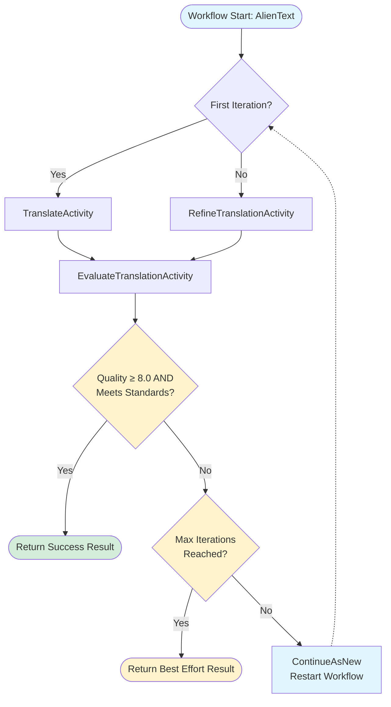

# Alien Translator - Evaluator-Optimizer Pattern

```mermaid
graph TD
    Start([Workflow Start: AlienText]) --> Check1{First Iteration?}
    Check1 -->|Yes| A1[TranslateActivity]
    Check1 -->|No| A3[RefineTranslationActivity]
    A1 --> A2[EvaluateTranslationActivity]
    A3 --> A2
    A2 --> Gate1{Quality ≥ 8.0 AND<br/>Meets Standards?}
    Gate1 -->|Yes| Success([Return Success Result])
    Gate1 -->|No| Gate2{Max Iterations<br/>Reached?}
    Gate2 -->|Yes| MaxReached([Return Best Effort Result])
    Gate2 -->|No| Restart[ContinueAsNew<br/>Restart Workflow]
    Restart -.-> Check1
    
    style Start fill:#e1f5ff
    style Success fill:#d4edda
    style MaxReached fill:#fff3cd
    style Gate1 fill:#fff3cd
    style Gate2 fill:#fff3cd
    style Restart fill:#e1f5ff
```