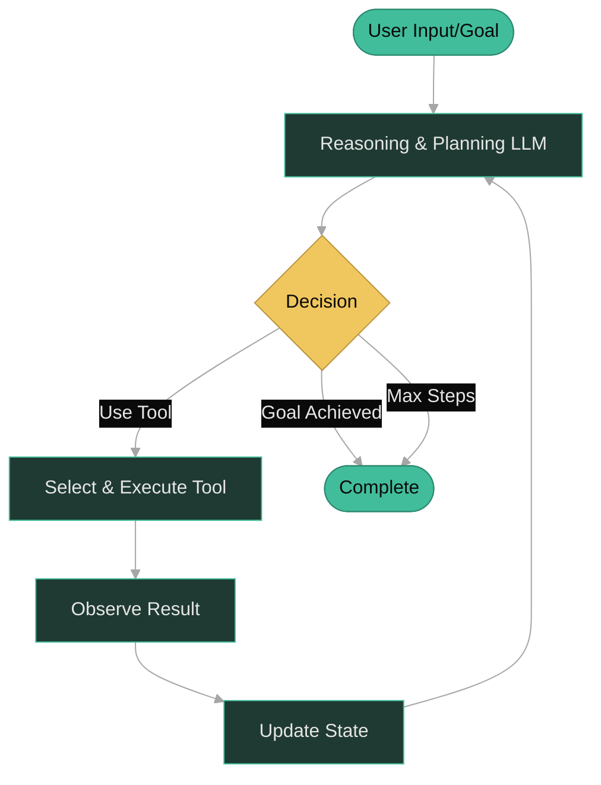

# Autonomous Agent Diagram

```mermaid
%%{init: {"theme":"base","themeVariables":{"background":"#0a0a0a","primaryColor":"#1f3a32","primaryTextColor":"#e6e6e6","primaryBorderColor":"#41BD9B","lineColor":"#A6A6A6","secondaryColor":"#111315","tertiaryColor":"#111315","clusterBkg":"#111315","clusterBorder":"#41BD9B","titleColor":"#F0C75E","edgeLabelBackground":"#0a0a0a","noteBkgColor":"#111315","noteTextColor":"#e6e6e6","noteBorderColor":"#41BD9B","actorBkg":"#1f3a32","actorBorder":"#41BD9B","actorTextColor":"#e6e6e6","actorLineColor":"#A6A6A6","signalColor":"#A6A6A6","signalTextColor":"#e6e6e6","labelBoxBkgColor":"#0a0a0a","labelBoxBorderColor":"#41BD9B","labelTextColor":"#e6e6e6","loopTextColor":"#e6e6e6","altSectionBkgColor":"#111315","sectionBkgColor":"#111315","fontFamily":"Geist,sans-serif"}}}%%
graph TD
    Start([User Input/Goal]) --> A1[Reasoning & Planning LLM]
    A1 --> Gate{Decision}
    Gate -->|Use Tool| A3[Select & Execute Tool]
    Gate -->|Goal Achieved| End([Complete])
    Gate -->|Max Steps| End
    A3 --> A4[Observe Result]
    A4 --> A5[Update State]
    A5 --> A1
    
    style Start fill:#41BD9B,stroke:#2d8a70,color:#0a0a0a
    style Gate fill:#F0C75E,stroke:#b8943f,color:#0a0a0a
    style A3 fill:#1f3a32,stroke:#41BD9B,color:#e6e6e6
    style End fill:#41BD9B,stroke:#2d8a70,color:#0a0a0a
```

### Agent Loop

Perceive → Reason → Act → Observe → Repeat
