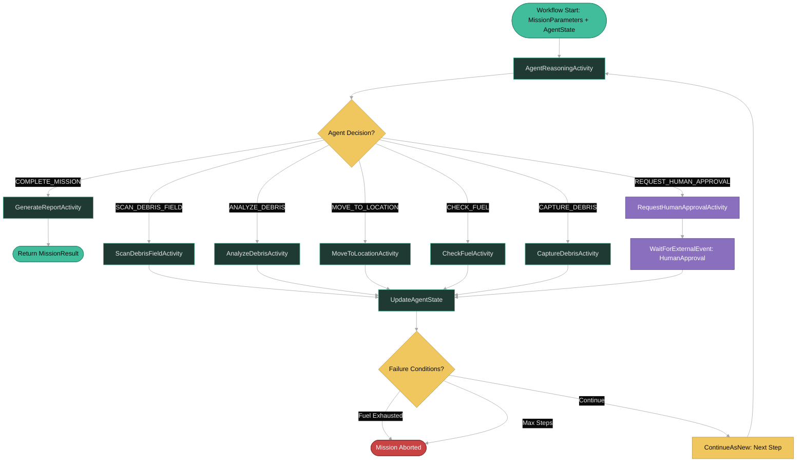

# Demo: Space Debris Cleanup - Autonomous Agent

```mermaid
%%{init: {"theme":"base","themeVariables":{"background":"#0a0a0a","primaryColor":"#1f3a32","primaryTextColor":"#e6e6e6","primaryBorderColor":"#41BD9B","lineColor":"#A6A6A6","secondaryColor":"#111315","tertiaryColor":"#111315","clusterBkg":"#111315","clusterBorder":"#41BD9B","titleColor":"#F0C75E","edgeLabelBackground":"#0a0a0a","noteBkgColor":"#111315","noteTextColor":"#e6e6e6","noteBorderColor":"#41BD9B","actorBkg":"#1f3a32","actorBorder":"#41BD9B","actorTextColor":"#e6e6e6","actorLineColor":"#A6A6A6","signalColor":"#A6A6A6","signalTextColor":"#e6e6e6","labelBoxBkgColor":"#0a0a0a","labelBoxBorderColor":"#41BD9B","labelTextColor":"#e6e6e6","loopTextColor":"#e6e6e6","altSectionBkgColor":"#111315","sectionBkgColor":"#111315","fontFamily":"Geist,sans-serif"}}}%%
graph TD
    Start([Workflow Start: MissionParameters + AgentState]) --> A1[AgentReasoningActivity]
    A1 --> Router{Agent Decision?}
    Router -->|COMPLETE_MISSION| A2[GenerateReportActivity]
    A2 --> End([Return MissionResult])
    Router -->|SCAN_DEBRIS_FIELD| T1[ScanDebrisFieldActivity]
    Router -->|ANALYZE_DEBRIS| T2[AnalyzeDebrisActivity]
    Router -->|MOVE_TO_LOCATION| T3[MoveToLocationActivity]
    Router -->|CHECK_FUEL| T4[CheckFuelActivity]
    Router -->|CAPTURE_DEBRIS| T5[CaptureDebrisActivity]
    Router -->|REQUEST_HUMAN_APPROVAL| T6[RequestHumanApprovalActivity]
    T1 --> Update[UpdateAgentState]
    T2 --> Update
    T3 --> Update
    T4 --> Update
    T5 --> Update
    T6 --> Wait[WaitForExternalEvent: HumanApproval]
    Wait --> Update
    Update --> Check{Failure Conditions?}
    Check -->|Fuel Exhausted| Fail([Mission Aborted])
    Check -->|Max Steps| Fail
    Check -->|Continue| ContinueAsNew[ContinueAsNew: Next Step]
    ContinueAsNew --> A1
    
    style Start fill:#41BD9B,stroke:#2d8a70,color:#0a0a0a
    style End fill:#41BD9B,stroke:#2d8a70,color:#0a0a0a
    style Fail fill:#c84444,stroke:#8a2a2a,color:#ffffff
    style Router fill:#F0C75E,stroke:#b8943f,color:#0a0a0a
    style Check fill:#F0C75E,stroke:#b8943f,color:#0a0a0a
    style T1 fill:#1f3a32,stroke:#41BD9B,color:#e6e6e6
    style T2 fill:#1f3a32,stroke:#41BD9B,color:#e6e6e6
    style T3 fill:#1f3a32,stroke:#41BD9B,color:#e6e6e6
    style T4 fill:#1f3a32,stroke:#41BD9B,color:#e6e6e6
    style T5 fill:#1f3a32,stroke:#41BD9B,color:#e6e6e6
    style T6 fill:#8B6FBF,stroke:#5d4a87,color:#ffffff
    style Wait fill:#8B6FBF,stroke:#5d4a87,color:#ffffff
    style ContinueAsNew fill:#F0C75E,stroke:#b8943f,color:#0a0a0a
```