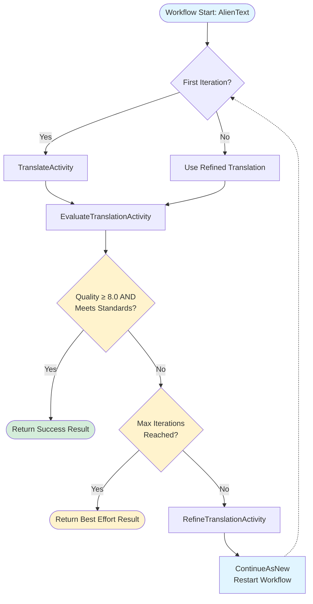

# Alien Translator - Evaluator-Optimizer Pattern

This demo implements an **evaluator-optimizer workflow** using Dapr Workflow for alien language translation refinement. The system generates an initial translation, then iteratively evaluates and refines it through multiple rounds until it meets quality standards.

## Pattern Overview

The evaluator-optimizer pattern separates translation generation from quality evaluation:

1. **Translator** (TranslateActivity/RefineTranslationActivity) - Generates and improves translations
2. **Evaluator** (EvaluateTranslationActivity) - Assesses quality and provides feedback
3. **Workflow** (EvaluatorOptimizerWorkflow) - Orchestrates the iterative refinement loop

## Architecture



### Workflow Logic
1. Generate initial translation
2. Loop (max 5 iterations):
   - Evaluate current translation
   - If quality ≥ 8.0 and meets standards → Success!
   - If max iterations reached → Return best effort
   - Refine translation based on feedback
3. Return final translation with iteration history

### Quality Metrics
- **Accuracy Score** (0-10): Faithfulness to original meaning
- **Cultural Nuance Score** (0-10): Preservation of cultural context
- **Idiomatic Score** (0-10): Natural English readability
- **Overall Quality** (0-10): Holistic assessment

## Running the Demo

### Prerequisites
- .NET 9 SDK
- Dapr CLI
- Ollama with llama3.2:latest model

### Start Ollama
```bash
ollama serve
```

### Run the Application
```bash
cd AlienTranslator
dapr run -f dapr.yaml
```

### Test with REST Client
Open `local.http` in VS Code and execute the requests to:
1. Submit alien text for translation
2. Check translation status and results
3. View specific iteration details

## Benefits
- ✅ Iterative quality improvement with measurable metrics
- ✅ Specialized LLM roles (translator vs. evaluator)
- ✅ Detailed feedback loop for targeted refinements
- ✅ Graceful degradation with max iteration limit

## Drawbacks
- ❌ Higher latency (multiple LLM calls per translation)
- ❌ More expensive (10+ LLM calls for 5 iterations)
- ❌ Potential diminishing returns in later iterations
- ❌ Evaluation subjectivity (LLM can't verify true accuracy)

## When to Use
Use this pattern when quality is more important than speed and iterative refinement demonstrably improves results. Ideal for diplomatic communications, literary translation, and content requiring editorial review.
