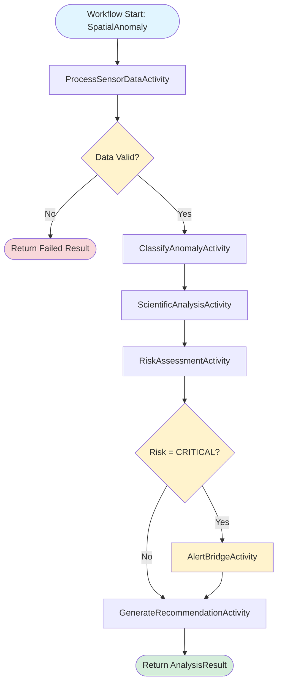

# Data's Spatial Anomaly Analysis System

This application implements Data's Spatial Anomaly Analysis System using Dapr Workflow to orchestrate a prompt chaining pattern. The system analyzes spatial anomalies detected by the USS Enterprise-D's sensors through a sequential 5-stage process.

## Pattern Overview

The **prompt chaining pattern** orchestrates multiple LLM calls in a sequential pipeline, where each stage's output becomes context for the next stage. This demo implements a 5-stage anomaly analysis workflow:

1. **Process Sensor Data** - Validates and normalizes raw sensor readings
2. **Classify Anomaly** - Categorizes the anomaly type and severity
3. **Scientific Analysis** - Deep dive into the physical phenomena
4. **Risk Assessment** - Evaluates potential threats to ship and crew
5. **Generate Recommendation** - Produces actionable response strategies
6. **Alert Bridge** (conditional) - Immediate notification for critical anomalies

### Benefits

- ✅ Sequential processing builds rich context across stages
- ✅ Specialized prompts optimized for each analysis phase
- ✅ Clear separation of concerns (validation → classification → analysis → recommendations)
- ✅ Easier debugging and monitoring per stage
- ✅ Workflow state management ensures reliability and observability

### Drawbacks

- ❌ Higher latency from sequential processing (no parallelization)
- ❌ Error in early stages blocks later stages
- ❌ Context window limitations with long chains
- ❌ More expensive than single LLM call

### When to Use

Use this pattern when analysis requires multiple specialized stages building on each other's output, and when the problem domain benefits from decomposition into distinct reasoning phases. Ideal for complex analysis, decision trees, and multi-step reasoning tasks.

## Architecture



- **Workflow**: `AnomalyAnalysisWorkflow` - Orchestrates 5 sequential stages
- **Activities**: Each stage is an LLM-powered activity using DaprConversationClient
  - ProcessSensorDataActivity
  - ClassifyAnomalyActivity
  - ScientificAnalysisActivity
  - RiskAssessmentActivity
  - GenerateRecommendationActivity
  - AlertBridgeActivity (triggered for critical anomalies)

## Running the Demo

### Prerequisites

- Docker Desktop or Podman
- .NET 9 SDK
- Dapr CLI
- Ollama

### Start Ollama

```bash
ollama serve
ollama run llama3.2:3b
```

### Start the Diagrid Dev Dashboard

```bash
docker run -p 8080:8080 ghcr.io/diagridio/diagrid-dashboard:latest
```

### Run the Application

```bash
cd AnomalyAnalysis
dapr run -f dapr.yaml
```

### Test with REST Client

Open `local.http` in VS Code and execute the requests to analyze anomalies.

### Inspect the Workflow runs

Open the Diagrid Dev Dashboard at `http://localhost:8080` and inspect the workflow executions.

