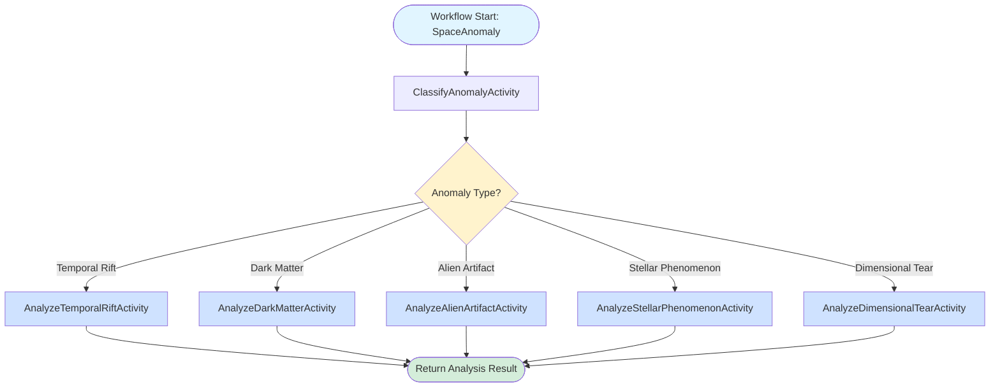

# Galactic Anomaly Classifier

This project demonstrates **Workflow Routing** using Dapr Workflow to classify and route different types of space anomalies to specialized analysis pipelines.

## Pattern Overview

## Architecture



The system uses a two-stage workflow:

1. **Classification Stage**: An LLM-powered classifier determines the anomaly type from sensor data
2. **Routing Stage**: Based on classification, routes to one of five specialized analysis activities:
   - **Temporal Rift** → Quantum Chronodynamics Analysis
   - **Dark Matter Cluster** → Gravitational Physics Analysis
   - **Alien Artifact** → Xenoarchaeology Analysis
   - **Stellar Phenomenon** → Astrophysics Analysis
   - **Dimensional Tear** → Multiverse Theory Analysis

## Running the Demo

### Prerequisites

- Docker Desktop or Podman
- .NET 9 SDK
- Dapr CLI
- Ollama

### Start Ollama

```bash
ollama serve
ollama run llama3.2:3b
```

### Start the Diagrid Dev Dashboard

```bash
docker run -p 8080:8080 ghcr.io/diagridio/diagrid-dashboard:latest
```

### Run the Application

```bash
cd GalacticAnomalyClassifier
dapr run -f dapr.yaml
```

### Test with REST Client

Open `local.http` in VS Code and execute the requests to classify different anomalies.

### Inspect the Workflow runs

Open the Diagrid Dev Dashboard at `http://localhost:8080` and inspect the workflow executions.

## Key Features

- **Intelligent Routing**: LLM-powered classification routes to appropriate specialist
- **Specialized Analysis**: Each anomaly type gets domain-specific analysis
- **Durable Workflows**: Dapr Workflow ensures reliable execution
- **State Management**: Anomaly data and results persisted in state store
- **Observability**: Full workflow tracking and monitoring

## Benefits of Routing Pattern

1. **Specialized Optimization** - Different models and prompts per route
2. **Better Accuracy** - Domain-specific expertise for each category
3. **Cost Efficiency** - Use appropriate model size per complexity
4. **Easy Extension** - Add new anomaly types without affecting existing routes
5. **Clear Metrics** - Track performance per classification type

