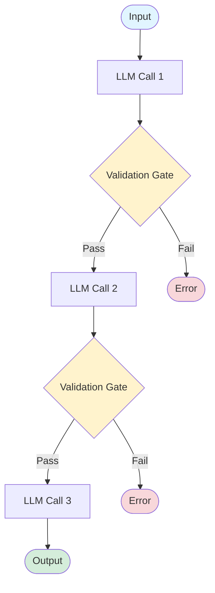
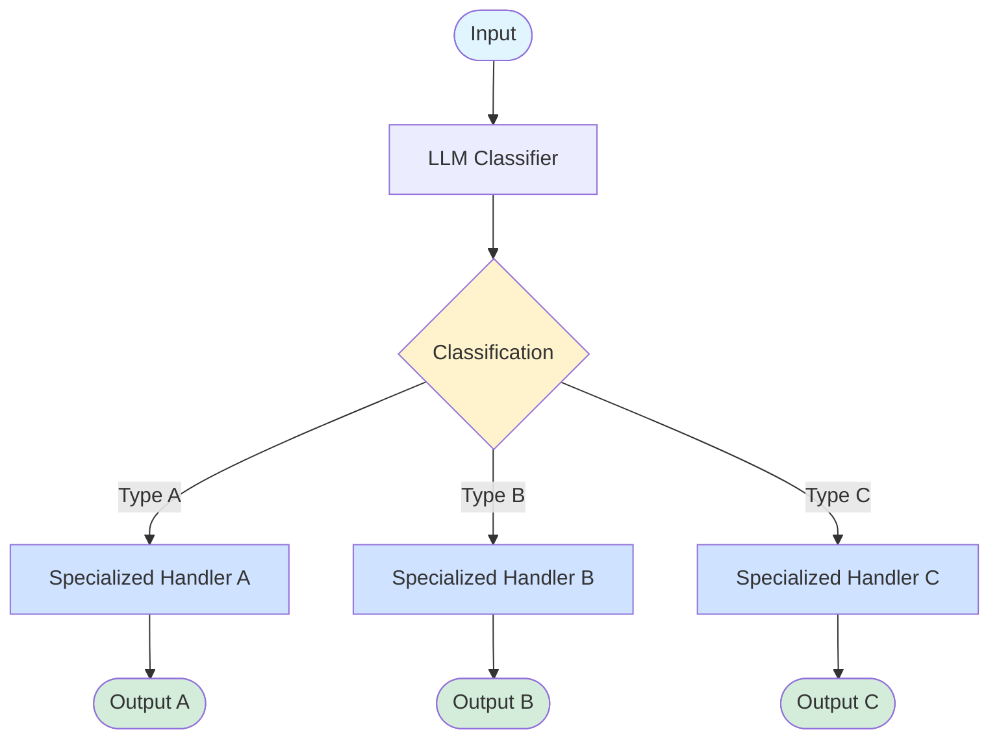
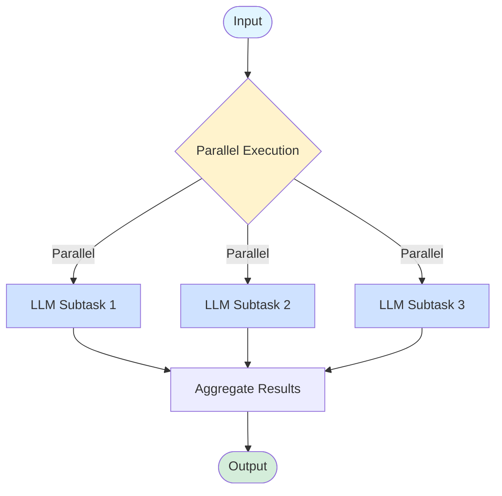
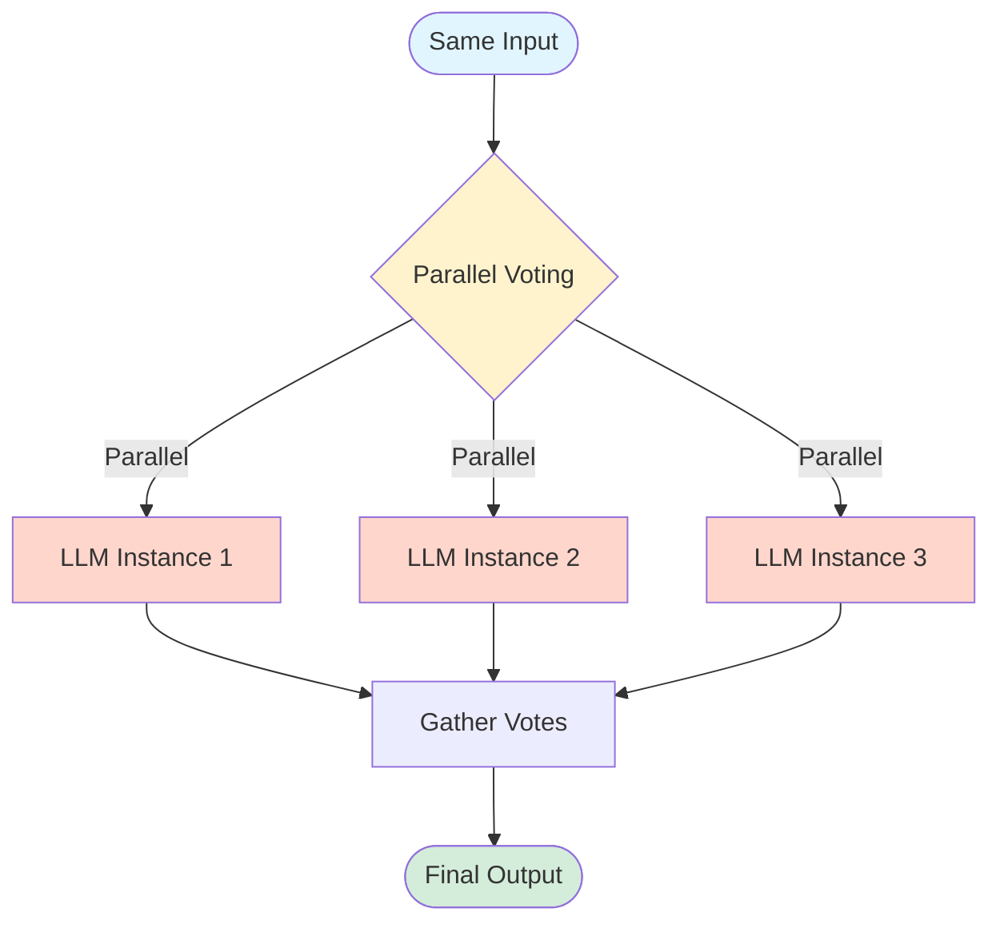
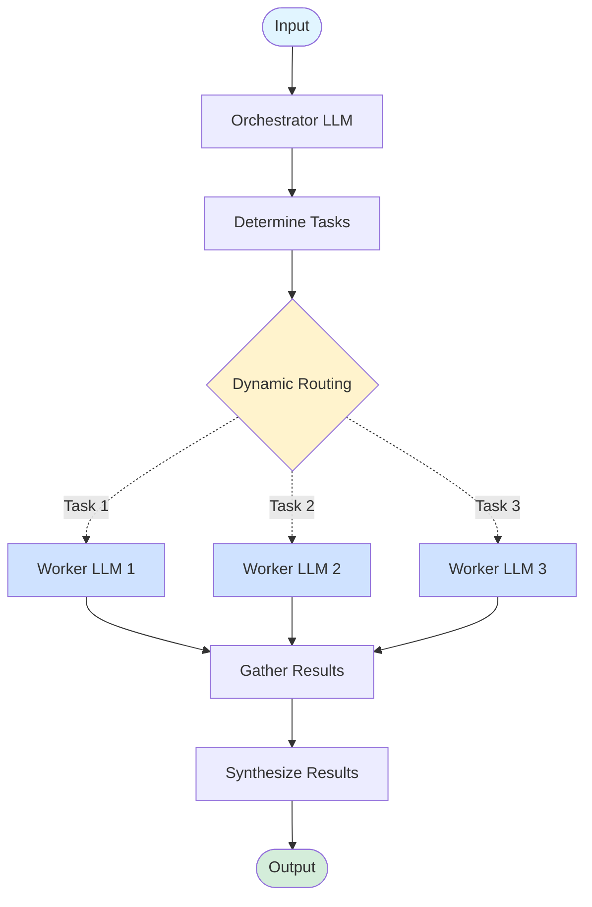
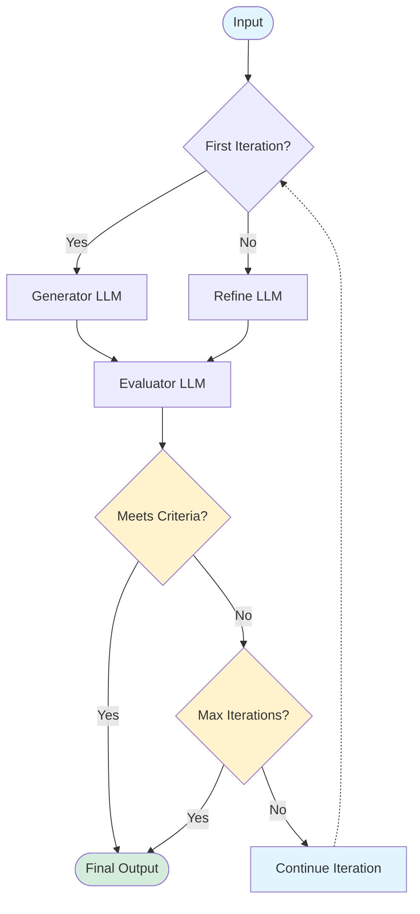
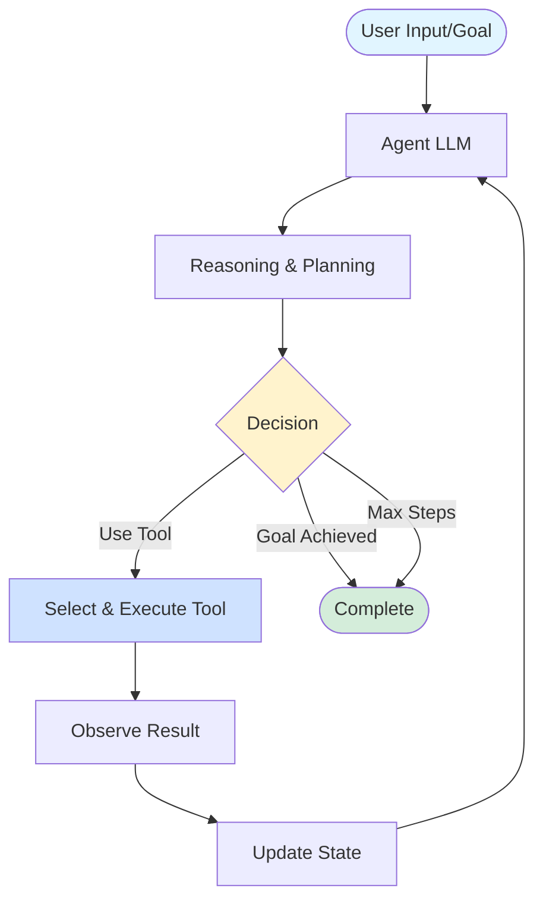

# Presentation Plan: Reliable Agentic Systems Need Durable Execution

## Metadata
- **Title**: Reliable agentic systems need durable execution
- **Format**: Markdown-based slides
- **Target Duration**: 45-60 minutes
- **Demo Projects**: AlienTranslator, AnomalyAnalysis, GalacticAnomalyClassifier, SpaceDebrisAgent, StarshipDiagnostics, SpaceColonyPlanner

---

## Slide Structure Plan

### 1. Title Slide
**Content:**
- Title: "Reliable Agentic Systems Need Durable Execution"
- Subtitle: "Building Production-Ready AI Agents with Dapr"
- Speaker info
- Conference/Event name

**Visual Elements:**
- Background with distributed systems motif
- Dapr logo
- .NET logo

---

### 2. Introduction Slide
**Key Points:**
- Who am I
- Why this topic matters
- What you'll learn today

**Talking Points:**
- The AI agent hype vs reality
- Production systems need reliability
- Combining distributed systems expertise with AI

---

### 3. Section: Agentic Systems and Their Issues

#### Slide 3.1: What are Agentic Systems?
**Content:**
- Definition of agentic AI systems
- Components: LLMs, tools, memory, planning
- Difference from traditional chatbots

**Visual Elements:**
- Diagram showing agent architecture
- LLM → Reasoning → Action → Tool → Response cycle

#### Slide 3.2: The Reality of Building Agents
**Content:**
- Everyone is building agents
- Common use cases
- The promise vs the reality

**Key Points:**
- Customer service automation
- Data analysis agents
- Code generation assistants
- Content creation systems

#### Slide 3.3: Production Challenges
**Content:**
- What happens when things go wrong?

**Key Issues:**
- LLM API failures (rate limits, timeouts)
- Non-deterministic responses
- State management across calls
- Cost management (failed retries)
- Monitoring and debugging
- Partial completion recovery

**Visual Elements:**
- Error scenarios diagram
- Cost accumulation chart

#### Slide 3.4: Distributed Systems Problems
**Content:**
- Agentic systems ARE distributed systems

**Challenges:**
- Network reliability
- Service availability
- Data consistency
- Fault tolerance
- Observability

**Talking Points:**
- We've been here before with microservices
- Let's apply what we know

---

### 4. Section: Reliable Systems with Durable Execution

#### Slide 4.1: What is Durable Execution?
**Content:**
- Definition and core concept
- Automatic state persistence
- Transparent recovery
- Replay mechanism

**Key Points:**
- Code runs to completion despite failures
- State automatically checkpointed
- Automatic retries with idempotency
- Timeline of execution preserved

#### Slide 4.2: Benefits for Agentic Systems
**Content:**
- Why durable execution matters for AI agents

**Benefits:**
- Resume from last checkpoint (not from scratch)
- Save on LLM costs
- Predictable behavior
- Built-in observability
- Simplified error handling

**Visual Elements:**
- Before/after comparison diagram
- Cost savings illustration

#### Slide 4.3: Durable Execution Patterns
**Content:**
- Common patterns enabled by durable execution

**Patterns:**
- Long-running workflows
- Human-in-the-loop
- Saga pattern for compensation
- Event-driven orchestration

---

### 5. Section: Dapr Workflow

#### Slide 5.1: What is Dapr?
**Content:**
- Distributed Application Runtime
- CNCF graduated project
- Building blocks for distributed apps
- Language agnostic (focus on .NET)

**Visual Elements:**
- Dapr architecture diagram
- Building blocks overview

#### Slide 5.2: Dapr Workflow Building Block
**Content:**
- Workflow engine overview
- Based on Durable Task Framework
- Features and capabilities

**Key Features:**
- Durable execution out of the box
- Activity orchestration
- State management
- Timer and scheduling
- Sub-workflows
- External events

#### Slide 5.3: Workflow Programming Model
**Content:**
- Code example showing basic structure

**Components:**
- Workflow definition
- Activities (deterministic tasks)
- DaprWorkflowClient
- Starting and querying workflows

**Code Example:**
```csharp
[DaprWorkflow]
public class MyWorkflow : Workflow<Input, Output>
{
    public override async Task<Output> RunAsync(
        WorkflowContext context, Input input)
    {
        var result = await context.CallActivityAsync<string>(
            nameof(MyActivity), input);
        return new Output(result);
    }
}
```

#### Slide 5.4: How Workflow Enables Reliability
**Content:**
- Replay mechanism
- State checkpointing
- Automatic retries
- Idempotency guarantees

**Visual Elements:**
- Timeline showing failure and replay
- State checkpoint diagram

---

### 6. Section: Dapr Conversation API

#### Slide 6.1: Introducing Conversation API
**Content:**
- New building block in Dapr
- Unified interface for LLM providers
- Multi-modal support
- Provider abstraction

**Key Points:**
- Works with OpenAI, Azure OpenAI, Anthropic, etc.
- Consistent programming model
- Easy to switch providers
- Built-in resilience

#### Slide 6.2: Conversation API Features
**Content:**
- Core capabilities

**Features:**
- Text generation
- Multi-turn conversations
- Structured outputs
- Tool/function calling
- Streaming responses
- Vision/multi-modal

#### Slide 6.3: Code Example
**Content:**
- Simple conversation example

**Demo Project Reference:**
- ConversationTests project

**Code Example:**
```csharp
var request = new ConversationRequest
{
    Messages = [
        new Message { Role = "user", Content = prompt }
    ]
};

var response = await daprClient.ConversationAsync(
    "myconversation", request);
```

#### Slide 6.4: Benefits for Agentic Systems
**Content:**
- Why use Conversation API?

**Benefits:**
- Provider independence
- Consistent error handling
- Built-in retries and circuit breakers
- Observability hooks
- Cost tracking capabilities
- Easier testing (mock providers)

---

### 7. Section: Agentic Patterns Overview

#### Slide 7.1: Common Agentic Patterns
**Content:**
- Overview of patterns to cover
- When to use each pattern

**Patterns List:**
1. Prompt Chaining
2. Routing
3. Parallelization
4. Orchestrator-Workers
5. Evaluator-Optimizer
6. Autonomous Agent

**Visual Elements:**
- Pattern decision tree
- Complexity vs capability matrix

#### Slide 7.2: Pattern Selection Guide
**Content:**
- How to choose the right pattern
- Find the simplest solution that works
- Add complexity only when needed

**Criteria:**
- Task complexity
- Required reliability
- Latency requirements
- Cost considerations
- Human oversight needs
- Predictability of subtasks

**Key Principle:**
- Start simple, optimize with evaluation, add complexity only when simpler solutions fall short

---

### 8. Section: Prompt Chaining

#### Slide 8.1: What is Prompt Chaining?
**Content:**
- Sequential LLM calls
- Output of one → input to next
- Progressive refinement

**When to Use:**
- Task can be easily and cleanly decomposed into fixed subtasks
- Trade latency for higher accuracy by making each LLM call easier

**Use Cases:**
- Multi-step analysis
- Content generation pipeline
- Translation with refinement
- Generating marketing copy, then translating it
- Writing outline, checking criteria, then writing document

**Pros:**
- Higher accuracy through task decomposition
- Each step is simpler and more focused
- Can add validation gates between steps
- Clear audit trail

**Cons:**
- Higher latency (sequential processing)
- Increased cost (multiple LLM calls)
- Fixed path - not flexible to different inputs

**Visual Elements:**
- Chain diagram: Input → LLM1 → LLM2 → LLM3 → Output

**Mermaid Diagram:**


#### Slide 8.2: Implementation with Dapr Workflow
**Content:**
- How Workflow enables reliable chaining

**Benefits:**
- Each step automatically checkpointed
- Restart from failure point
- Audit trail of all steps
- Cost optimization (no re-execution)

**Demo Project Reference:**
- AlienTranslator project (if it uses chaining)

#### Slide 8.3: Code Example
**Content:**
- Workflow with sequential activities

**Code Example:**
```csharp
var step1 = await context.CallActivityAsync<string>(
    nameof(TranslateActivity), input);

var step2 = await context.CallActivityAsync<string>(
    nameof(RefineTranslationActivity), step1);

var step3 = await context.CallActivityAsync<Result>(
    nameof(EvaluateTranslationActivity), step2);
```

#### Slide 8.4: Demo: Alien Translation
**Content:**
- Live demo or walkthrough

**Demo Steps:**
1. Show workflow definition
2. Start translation workflow
3. Show state checkpoints
4. Simulate failure and recovery
5. Show final result

---

### 9. Section: Routing

#### Slide 9.1: What is Routing?
**Content:**
- Conditional execution based on input
- Intent classification
- Dynamic path selection

**When to Use:**
- Complex tasks with distinct categories better handled separately
- Classification can be handled accurately
- Separation of concerns needed

**Use Cases:**
- Customer service routing (general, refunds, technical support)
- Content classification
- Severity-based handling
- Routing simple queries to cheaper models, complex to more capable models

**Pros:**
- Specialized prompts for each category
- Optimizing for one input doesn't hurt others
- Cost optimization (route to appropriate model size)
- Better performance through specialization

**Cons:**
- Classification step adds latency
- Requires accurate classification
- Need to maintain multiple specialized handlers
- More complex infrastructure

**Visual Elements:**
- Decision tree diagram
- Input → Classifier → Route A/B/C

**Mermaid Diagram:**


#### Slide 9.2: Implementation Pattern
**Content:**
- Classification activity
- Conditional branching in workflow
- Type-specific handlers

**Demo Project Reference:**
- GalacticAnomalyClassifier project

#### Slide 9.3: Code Example
**Content:**
- Workflow with conditional routing

**Code Example:**
```csharp
var classification = await context.CallActivityAsync<string>(
    nameof(ClassifyActivity), input);

if (classification == "TypeA")
{
    result = await context.CallActivityAsync<Result>(
        nameof(HandleTypeA), input);
}
else if (classification == "TypeB")
{
    result = await context.CallActivityAsync<Result>(
        nameof(HandleTypeB), input);
}
```

#### Slide 9.4: Demo: Anomaly Classification
**Content:**
- Live demo

**Demo Steps:**
1. Submit different anomaly types
2. Show classification logic
3. Show routing to different handlers
4. Display results

---

### 10. Section: Parallelization

#### Slide 10.1: What is Parallelization?
**Content:**
- Concurrent task execution
- Independent LLM calls
- Aggregate results

**Two Variations:**
- **Sectioning**: Breaking task into independent subtasks run in parallel
- **Voting**: Running same task multiple times for diverse outputs

**When to Use:**
- Subtasks can be parallelized for speed
- Multiple perspectives needed for higher confidence
- Complex tasks with multiple considerations

**Use Cases:**
- **Sectioning**: Guardrails (process query + screen for inappropriate content), automated evals
- **Voting**: Code vulnerability review, content moderation with multiple evaluators
- Multi-source analysis
- Batch processing

**Pros:**
- Significantly reduced latency
- Better throughput
- Higher confidence through multiple perspectives
- LLMs perform better with focused attention per aspect

**Cons:**
- Increased cost (multiple LLM calls)
- Requires aggregation logic
- Tasks must be truly independent
- Need more complex orchestration

**Visual Elements:**
- Parallel execution diagram
- Latency comparison chart

**Mermaid Diagram - Sectioning:**


**Mermaid Diagram - Voting:**


#### Slide 10.2: Implementation with Dapr
**Content:**
- Task.WhenAll pattern
- Fan-out/fan-in
- Result aggregation

**Code Example:**
```csharp
var tasks = new List<Task<Result>>();
foreach (var item in items)
{
    tasks.Add(context.CallActivityAsync<Result>(
        nameof(ProcessActivity), item));
}

var results = await Task.WhenAll(tasks);
var aggregated = await context.CallActivityAsync<Summary>(
    nameof(AggregateActivity), results);
```

#### Slide 10.3: Demo: Parallel Analysis
**Content:**
- Show parallel execution

**Demo Project Reference:**
- AnomalyAnalysis or similar

**Demo Points:**
- Start multiple activities in parallel
- Show concurrent execution in logs
- Compare with sequential timing

---

### 11. Section: Orchestrator-Workers

#### Slide 11.1: What is Orchestrator-Workers?
**Content:**
- Central orchestrator coordinates workers
- Orchestrator dynamically breaks down tasks
- Delegates to worker LLMs
- Synthesizes results

**When to Use:**
- Complex tasks where subtasks can't be predicted upfront
- Dynamic decomposition needed based on input
- Different from parallelization: flexibility in subtask determination

**Use Cases:**
- Coding products (complex changes to multiple files)
- Research assistants
- Search tasks (gathering and analyzing from multiple sources)
- Multi-agent collaboration
- Complex planning tasks

**Pros:**
- Flexible - handles unpredictable task structures
- Scales to complex problems
- Clear separation of planning and execution
- Orchestrator maintains overall context

**Cons:**
- Higher complexity
- Orchestrator is single point of failure
- More LLM calls (orchestrator + workers)
- Requires sophisticated orchestration logic
- Higher latency and cost

**Visual Elements:**
- Orchestrator-workers architecture diagram

**Mermaid Diagram:**


#### Slide 11.2: Implementation Pattern
**Content:**
- Orchestrator workflow
- Worker activities
- Result consolidation

**Key Points:**
- Orchestrator maintains state
- Workers are stateless activities
- Durable execution tracks progress

**Demo Project Reference:**
- AnomalyAnalysis project
- SpaceColonyPlanner project

#### Slide 11.3: Code Example
**Content:**
- Orchestrator workflow structure

**Code Example:**
```csharp
// Orchestrator decomposes task
var tasks = await context.CallActivityAsync<List<Task>>(
    nameof(DecomposeActivity), input);

// Assign to workers
var results = new List<Result>();
foreach (var task in tasks)
{
    var result = await context.CallActivityAsync<Result>(
        nameof(WorkerActivity), task);
    results.Add(result);
}

// Consolidate results
return await context.CallActivityAsync<Output>(
    nameof(ConsolidateActivity), results);
```

#### Slide 11.4: Demo: Anomaly Analysis System
**Content:**
- Live demo

**Demo Steps:**
1. Show anomaly data input
2. Orchestrator decomposes analysis
3. Multiple workers process different aspects
4. Show consolidated report
5. Highlight durability (pause/resume)

---

### 12. Section: Evaluator-Optimizer

#### Slide 12.1: What is Evaluator-Optimizer?
**Content:**
- Iterative improvement loop
- One LLM generates, another evaluates
- Refinement until criteria met

**When to Use:**
- Clear evaluation criteria exist
- Iterative refinement provides measurable value
- LLM responses improve with articulated feedback
- LLM can provide useful feedback
- Analogous to human iterative writing process

**Use Cases:**
- Literary translation (capturing nuances through iteration)
- Content quality improvement
- Complex search tasks (multiple rounds based on evaluator)
- Code generation with validation

**Pros:**
- Progressive quality improvement
- Built-in quality control
- Can achieve high-quality outputs
- Mimics human refinement process

**Cons:**
- Unpredictable number of iterations
- High cost (multiple generation + evaluation calls)
- High latency
- Need clear exit criteria
- Risk of infinite loops without guardrails

**Visual Elements:**
- Feedback loop diagram
- Generate → Evaluate → Refine cycle

**Mermaid Diagram:**


#### Slide 12.2: Implementation Pattern
**Content:**
- Loop with exit condition
- Evaluation criteria
- Maximum iterations guard

**Key Points:**
- Workflow handles iteration naturally
- State preserved across iterations
- Guardrails prevent infinite loops

**Demo Project Reference:**
- AlienTranslator project

#### Slide 12.3: Code Example
**Content:**
- Iterative workflow

**Code Example:**
```csharp
var current = input;
var quality = 0.0;
var maxIterations = 5;

for (int i = 0; i < maxIterations; i++)
{
    current = await context.CallActivityAsync<string>(
        nameof(GenerateActivity), current);
    
    quality = await context.CallActivityAsync<double>(
        nameof(EvaluateActivity), current);
    
    if (quality >= threshold)
        break;
    
    current = await context.CallActivityAsync<string>(
        nameof(RefineActivity), current);
}

return current;
```

#### Slide 12.4: Demo: Translation Refinement
**Content:**
- Live demo

**Demo Steps:**
1. Initial translation
2. Quality evaluation
3. Refinement iteration
4. Show quality scores improving
5. Final output

---

### 13. Section: Autonomous Agent

#### Slide 13.1: What is an Autonomous Agent?
**Content:**
- Self-directed decision making
- LLM dynamically directs its own processes
- Tool selection and execution
- Goal-driven behavior
- Operates in a loop with environmental feedback

**When to Use:**
- Open-ended problems
- Difficult/impossible to predict required steps
- Can't hardcode a fixed path
- Need flexibility and model-driven decisions at scale
- Have trust in LLM decision-making
- Working in trusted/sandboxed environments

**Use Cases:**
- SWE-bench tasks (edits to many files)
- Computer use automation
- Research assistants
- Task automation
- Problem solving

**Characteristics:**
- Perception (input analysis)
- Reasoning (planning)
- Action (tool execution)
- Memory (state tracking)

**Pros:**
- Maximum flexibility
- Handles unpredictable scenarios
- Scales to complex, open-ended tasks
- Can adapt to unexpected situations
- Ideal for trusted environments

**Cons:**
- Highest cost and latency
- Potential for compounding errors
- Less predictable behavior
- Requires extensive testing
- Need strong guardrails and safety measures
- Requires excellent tool documentation (ACI)
- Higher risk in production

**Mermaid Diagram:**


#### Slide 13.2: Implementation Challenges
**Content:**
- Complexity vs reliability trade-off
- Managing agent loops
- Preventing runaway execution

**Solutions with Dapr:**
- Durable execution tracks all actions
- Timeouts and guardrails
- State visibility for debugging
- Cost controls

**Demo Project Reference:**
- SpaceDebrisAgent project

#### Slide 13.3: Code Example
**Content:**
- Agent loop structure

**Code Example:**
```csharp
var state = input;
var maxSteps = 10;

for (int step = 0; step < maxSteps; step++)
{
    var decision = await context.CallActivityAsync<Decision>(
        nameof(ReasoningActivity), state);
    
    if (decision.IsGoalAchieved)
        break;
    
    var actionResult = await context.CallActivityAsync<Result>(
        decision.SelectedTool, decision.ToolInput);
    
    state = await context.CallActivityAsync<State>(
        nameof(UpdateStateActivity), actionResult);
}

return state;
```

#### Slide 13.4: Demo: Space Debris Agent
**Content:**
- Live demo

**Demo Steps:**
1. Set agent goal
2. Show reasoning steps
3. Tool selection and execution
4. State updates
5. Goal achievement
6. Show full execution history

---

### 14. Section: Summary

#### Slide 14.1: Key Takeaways
**Content:**
- Main points to remember

**Takeaways:**
1. Agentic systems are distributed systems
2. Durable execution solves reliability issues
3. Dapr Workflow provides durable execution
4. Dapr Conversation API simplifies LLM integration
5. Multiple patterns for different use cases
6. Choose pattern based on requirements

#### Slide 14.2: Pattern Selection Summary
**Content:**
- Quick reference guide

**Table:**
| Pattern | Best For | Complexity | Cost | Latency | Flexibility |
|---------|----------|------------|------|---------|-------------|
| Prompt Chaining | Sequential, fixed subtasks | Low | Medium | High | Low |
| Routing | Distinct categories | Low | Low-Med | Low | Medium |
| Parallelization | Independent/voting tasks | Medium | High | Low | Low |
| Orchestrator-Workers | Dynamic decomposition | Medium | High | High | High |
| Evaluator-Optimizer | Iterative refinement | Medium | High | High | Medium |
| Autonomous Agent | Open-ended problems | High | Highest | Highest | Highest |

**Decision Framework:**
- Start simple → Add complexity only when measurable improvement
- Workflows (predictable) vs Agents (flexible)
- Consider: predictability, cost, latency, trust level

#### Slide 14.3: Getting Started
**Content:**
- Next steps for attendees

**Resources:**
- Dapr documentation: dapr.io
- GitHub repo with examples
- .NET Dapr SDK
- Community resources

**Call to Action:**
- Try the demo projects
- Join Dapr community
- Build your first agentic workflow

#### Slide 14.4: Questions?
**Content:**
- Contact information
- Links to resources
- Thank you message

---

## Presentation Delivery Notes

### Timing Breakdown (60 min total)
- Introduction & Agentic Systems Issues: 8 min
- Durable Execution Concept: 5 min
- Dapr Workflow: 7 min
- Dapr Conversation API: 5 min
- Agentic Patterns Overview: 3 min
- Prompt Chaining (demo): 6 min
- Routing (demo): 5 min
- Parallelization (demo): 4 min
- Orchestrator-Workers (demo): 7 min
- Evaluator-Optimizer (demo): 5 min
- Autonomous Agent (demo): 8 min
- Summary & Q&A: 7 min

### Demo Preparation Checklist
- [ ] Ensure all projects build successfully
- [ ] Test each demo workflow end-to-end
- [ ] Prepare failure scenarios for reliability demos
- [ ] Have pre-recorded backups for critical demos
- [ ] Test Dapr dashboard for visualizations
- [ ] Prepare sample inputs for each demo
- [ ] Verify API keys and configuration
- [ ] Test on presentation machine

### Key Messages to Emphasize
1. Reliability is not optional for production systems
2. Durable execution is the key to reliable agentic systems
3. Dapr makes complex patterns simple
4. .NET provides excellent tooling for building agents
5. Choose the right pattern for your use case

### Potential Questions to Prepare For
- How does this compare to LangChain/LlamaIndex?
- What about costs of running workflows?
- Can I use Python/Java/Go instead of .NET?
- How does this scale?
- What about security and auth?
- Can I run this without Kubernetes?
- How do I debug failed workflows?
- What LLM providers are supported?

### Backup Slides (Optional)
- Deeper dive into Durable Task Framework
- Dapr sidecar architecture
- State store options
- Observability and monitoring
- Security best practices
- Performance optimization
- Cost management strategies

