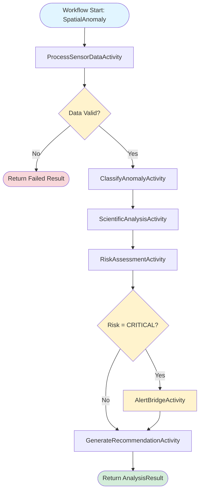
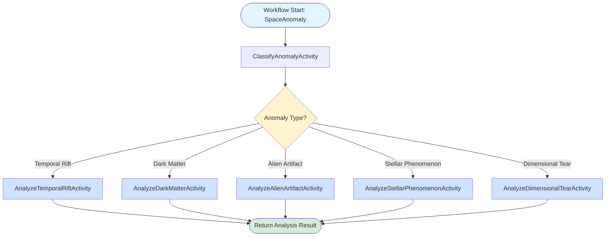
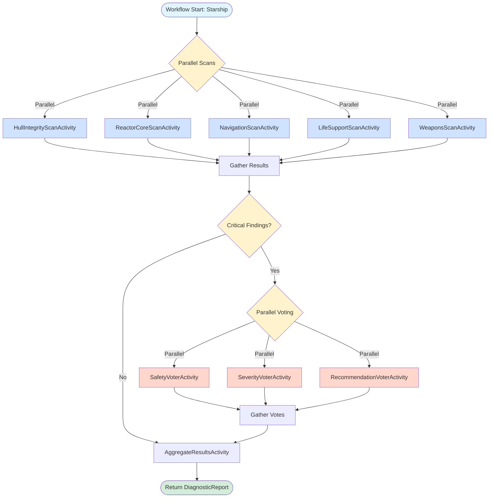
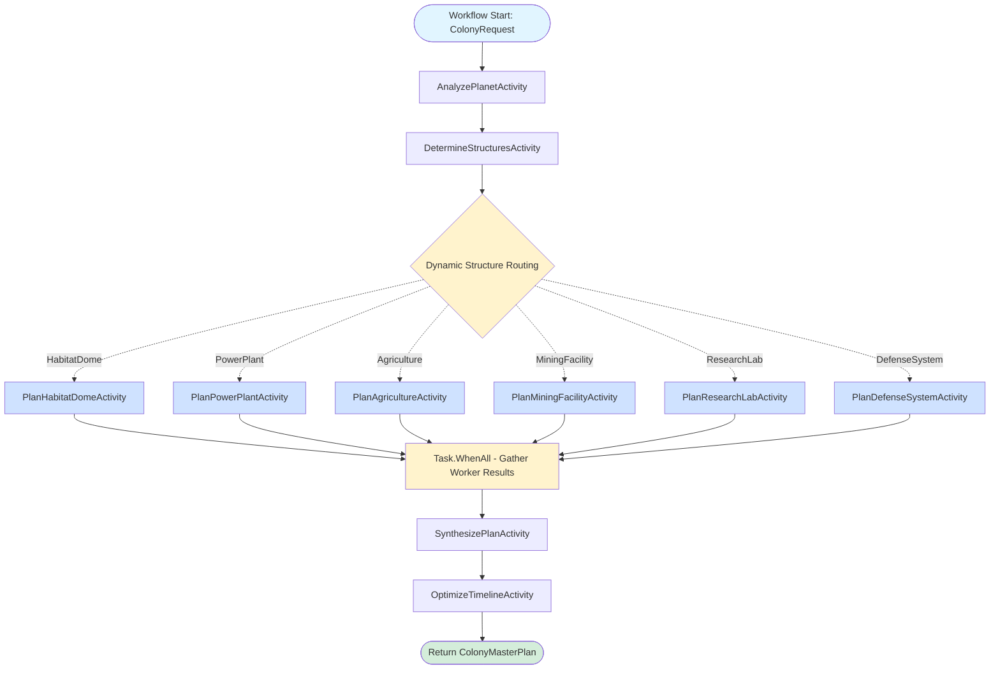
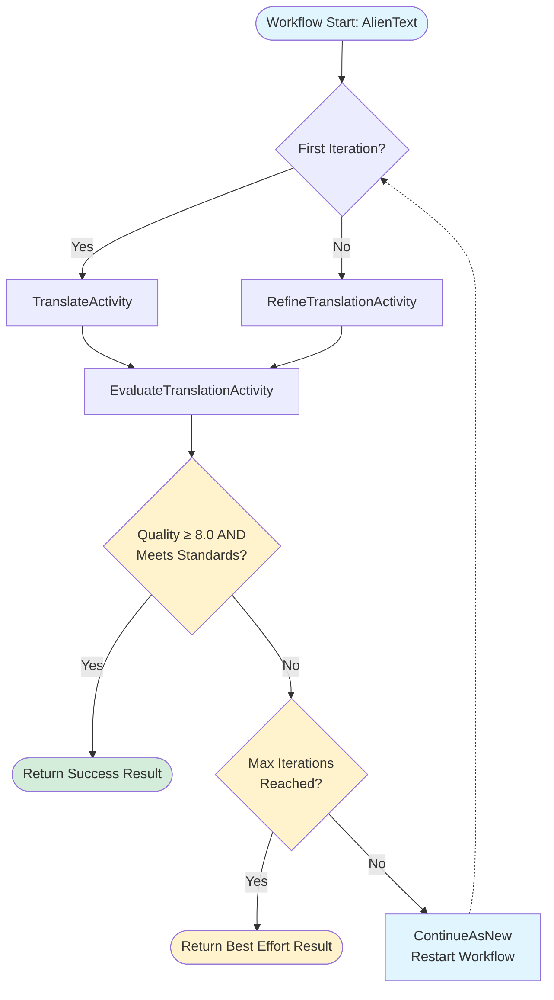
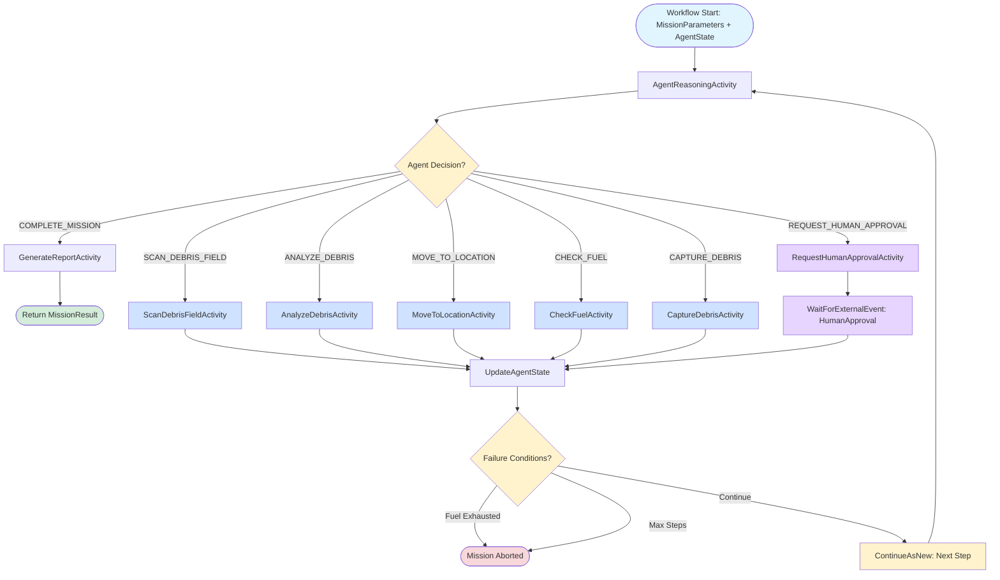

# Build reliable agentic systems with Dapr Workflow

This repository demonstrates how to build reliable agentic systems by combining Dapr Workflow orchestration with LLM-powered activities using the Dapr Conversation API.

## Overview

The demos showcase the patterns described in [Building Effective Agents](https://www.anthropic.com/engineering/building-effective-agents) by Anthropic, implemented using Dapr Workflow to orchestrate reliable multi-step processes and the Dapr Conversation API to interact with LLMs. Ollama is used as the local LLM provider for all demos.

## Benefits of Dapr Workflow and Conversation API

### Dapr Workflow

- **Deterministic control** over task execution with structured error handling and retries
- **Durable state management** that persists across failures and restarts
- **Built-in orchestration patterns** for complex multi-step processes
- **Reliable execution** with automatic recovery and compensation logic

### Dapr Conversation API

- **Flexibility and natural language understanding** through LLM integration
- **Provider-agnostic** interface supporting OpenAI, Azure OpenAI, Ollama, and more
- **Simplified LLM integration** with consistent API across different providers
- **Built-in caching** to optimize performance and reduce costs

### Combined Power

By combining deterministic workflows with the probabilistic nature of LLMs, you can build agentic systems that are both reliable and flexible, leveraging the best of both worlds.

## Agentic Patterns

| Pattern | Demo Project |
|---------|-------------|
| [Prompt Chaining](AnomalyAnalysis/README.md) | AnomalyAnalysis |
| [Routing](GalacticAnomalyClassifier/README.md) | GalacticAnomalyClassifier |
| [Parallelization](StarshipDiagnostics/README.md) | StarshipDiagnostics |
| [Orchestrator-Workers](SpaceColonyPlanner/README.md) | SpaceColonyPlanner |
| [Evaluator-Optimizer](AlienTranslator/README.md) | AlienTranslator |
| [Autonomous Agent](SpaceDebrisAgent/README.md) | SpaceDebrisAgent |

## Pattern Architectures

### Prompt Chaining - AnomalyAnalysis

### Routing - GalacticAnomalyClassifier

### Parallelization - StarshipDiagnostics

### Orchestrator-Workers - SpaceColonyPlanner

### Evaluator-Optimizer - AlienTranslator

### Autonomous Agent - SpaceDebrisAgent

## Prerequisites

1. Install a container orchestration tool such as Docker Desktop or Podman.
2. Install [.NET 9 SDK](https://dotnet.microsoft.com/download)
3. Install [Dapr CLI](https://docs.dapr.io/getting-started/install-dapr-cli/)
4. Install [Ollama](https://ollama.com/)
5. Initialize Dapr: `dapr init`
6. Run Ollama server: `ollama serve` and run a model: `ollama run llama3.2:3b`
7. Run Diagrid Dashboard: `docker run -p 8080:8080 ghcr.io/diagridio/diagrid-dashboard:latest`

See the individual demo README files for specific instructions how to run the applications.

## Next Steps

- Join the [Dapr Discord](https://bit.ly/dapr-discord) to connect with the community.
- Explore the [Diagrid Dev Dashboard](https://www.diagrid.io/blog/improving-the-local-dapr-workflow-experience-diagrid-dashboard) for workflow observability.
- Run your workflows and AI Agents reliably with [Diagrid Catalyst](https://www.diagrid.io/catalyst).
