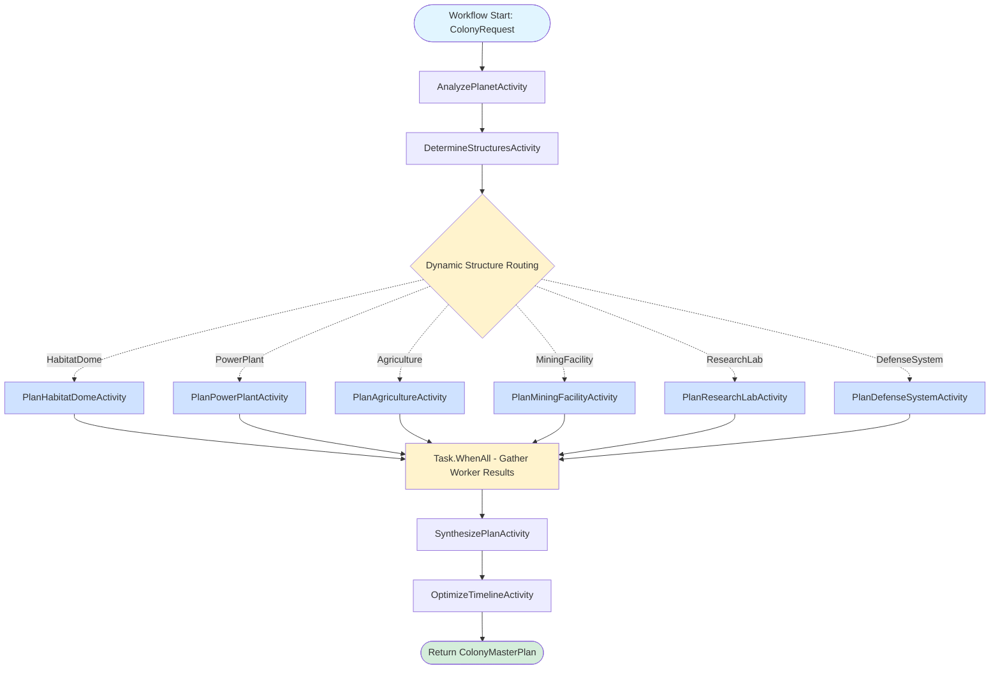

# Space Colony Planner

This demo implements an **orchestrator-worker workflow** using Dapr Workflow for dynamic colony construction planning.

## Overview

The orchestrator analyzes a planet's unique conditions and dynamically determines which specialist workers are needed to create a comprehensive colony construction plan. Different planets require different structures, making this an ideal use case for the orchestrator-worker pattern.

## Architecture



- **ColonyOrchestratorWorkflow** - Main orchestrator that coordinates the planning process
- **Analysis Activities** - Analyze planet, determine structures, and synthesize the master plan
- **Worker Activities** - Specialized planners for different structure types (habitat domes, power plants, agriculture, etc.)

## Running the Demo

### Prerequisites

1. Dapr CLI installed and initialized
2. Ollama running locally with llama3.2:latest model
3. .NET 9 SDK

### Start Ollama

```bash
ollama serve
```

### Run the Application

```bash
dapr run -f .
```

### Test the Workflow

Use the VSCode REST Client with `local.http` to:
1. POST a colony planning request with planet data
2. GET the status and results of your colony plan

## Key Features

- **Dynamic task decomposition** - The orchestrator determines which structures are needed based on planet conditions
- **Specialist workers** - Each structure type has a dedicated expert planner
- **Intelligent synthesis** - Results are combined into a coherent construction timeline
- **Scalable complexity** - Automatically adjusts to simple or complex colony requirements
