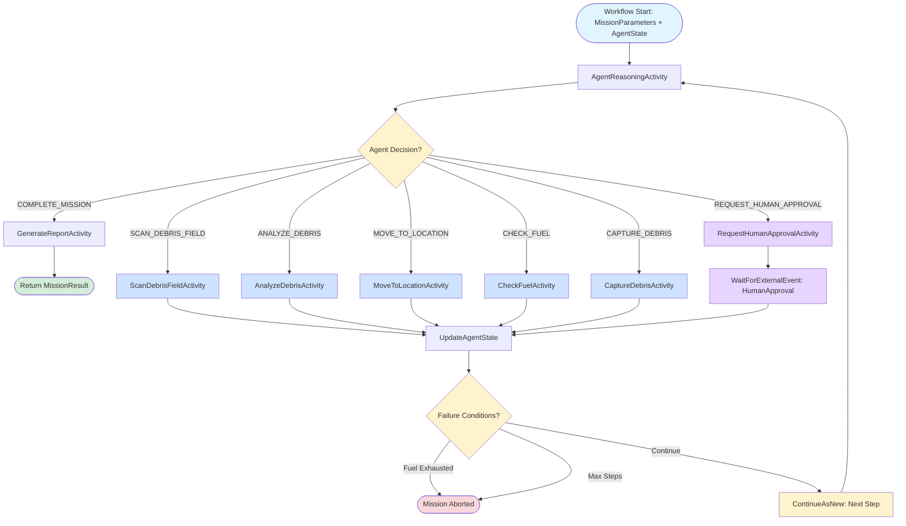

# Space Debris Cleanup - Autonomous Agent Pattern

This demo implements a fully autonomous agent using Dapr Workflow that controls a space debris cleanup mission. The agent makes its own decisions about scanning, analyzing, capturing debris, and requesting human approval for high-risk maneuvers.

## Pattern Overview

The **autonomous agent pattern** implements a self-directed reasoning loop where an LLM decides which actions to take based on current state and observations. This demo features:

1. **Agent Reasoning Loop** - LLM evaluates state and selects next action
2. **Tool Execution** - Agent can invoke tools (scan, move, capture, analyze)
3. **Human-in-the-Loop** - Requests approval for high-risk maneuvers
4. **State Persistence** - ContinueAsNew pattern maintains mission state
5. **Error Recovery** - Adapts to tool failures and unexpected situations

### Key Features

- **Autonomous Decision-Making**: Agent uses LLM to reason and choose actions
- **Tool Usage**: Scan, analyze, navigate, capture debris, check fuel
- **Human-in-the-Loop**: Requests approval for risky maneuvers with timeout
- **Error Recovery**: Adapts to tool failures and unexpected situations
- **State Persistence**: Continues mission across failures using ContinueAsNew
- **External Events**: Workflow waits for human approval via RaiseEventAsync

### Benefits

- ✅ Fully autonomous operation reduces manual intervention
- ✅ Adapts to dynamic environments and unexpected situations
- ✅ Human oversight for critical decisions
- ✅ Resilient to failures with state persistence
- ✅ Extensible tool library for new capabilities

### Drawbacks

- ❌ Unpredictable behavior - agent makes its own choices
- ❌ Higher latency from reasoning loop overhead
- ❌ More expensive due to multiple LLM calls per decision
- ❌ Requires careful prompt engineering for reliable behavior
- ❌ Difficult to debug when agent makes unexpected choices

### When to Use

Use this pattern when tasks require autonomous decision-making in dynamic environments, when the sequence of actions cannot be predetermined, or when you need adaptive behavior based on observations. Ideal for robotic control, dynamic task planning, and interactive systems requiring judgment calls.

## Architecture



- **SpaceDebrisCleanupWorkflow**: Main agent loop with ContinueAsNew pattern
- **AgentReasoningActivity**: LLM-based decision making
- **Tool Activities**: Scan, Capture, Move, Analyze, CheckFuel, RequestApproval
- **External Events**: Human approval with 1-minute timeout

## Running the Demo

### Prerequisites

- [.NET 10 SDK](https://dotnet.microsoft.com/en-us/download)
- [Aspire CLI](https://aspire.dev/get-started/install-cli/) — install with `dotnet tool install -g Aspire.Cli`
- [Docker](https://www.docker.com/products/docker-desktop/) or [Podman](https://podman.io/docs/installation)
- [Dapr CLI](https://docs.dapr.io/getting-started/install-dapr-cli/) (version 1.17+)
- [Ollama](https://ollama.com/) with the `llama3.2:3b` model pulled

### Start Ollama

```bash
ollama serve
ollama pull llama3.2:3b
```

### Run the Application

From the `SpaceDebrisAgent/` folder:

```bash
aspire run
```

This launches the Aspire AppHost, which orchestrates:
- A Valkey container for workflow state persistence (port 16379, password-protected)
- The ApiService with a Dapr sidecar (app ID `space-debris-agent`)
- The Diagrid Dev Dashboard container on http://localhost:18080

The Aspire dashboard opens automatically in the browser, showing all resources and their status.

### Test with REST Client

Open `SpaceDebrisAgent.ApiService/SpaceDebrisAgent.ApiService.http` in VS Code and execute the requests to start a cleanup mission. The ApiService HTTP port is shown in the Aspire dashboard.

### Inspect the Workflow runs

Open the Diagrid Dev Dashboard at `http://localhost:18080` and inspect the workflow executions.
