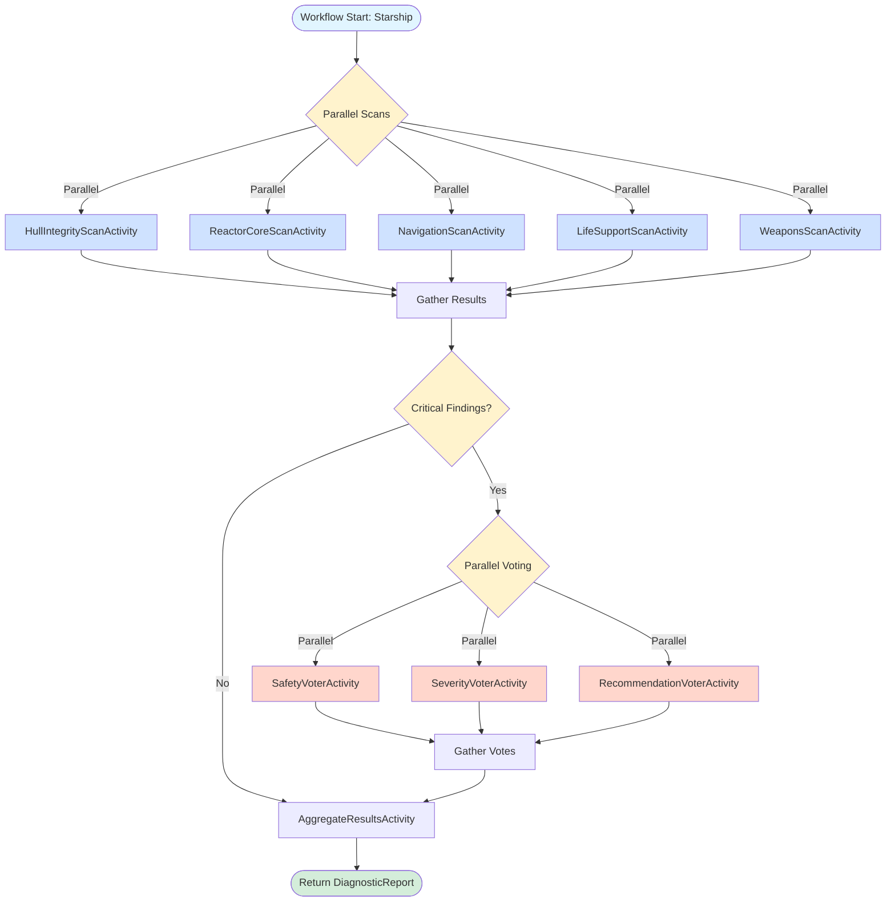

# StarshipDiagnostics - Parallel Workflow Pattern Demo

This demo implements the **parallelization workflow pattern** using Dapr Workflow to perform comprehensive diagnostics on starships like the USS Enterprise-D. The system runs multiple independent scans simultaneously (sectioning) across all major ship systems and uses voting mechanisms to assess critical findings.

## Features

- **Parallel Scanner Activities**: Five independent diagnostic scans run simultaneously
  - Hull Integrity Scanner
  - Reactor Core Scanner
  - Navigation Systems Scanner
  - Life Support Scanner
  - Tactical Systems Scanner

- **Voting Pattern**: Critical findings trigger parallel evaluation by three AI voters
  - Safety Voter (crew safety perspective)
  - Severity Voter (technical severity assessment)
  - Recommendation Voter (cost-benefit analysis)

- **Result Aggregation**: Combines all scan results and votes into a comprehensive diagnostic report

## Architecture



- **Dapr Workflow**: Orchestrates parallel execution and voting
- **Dapr State Management**: Stores scan results and maintenance history
- **Dapr Conversation API**: Powers each diagnostic scan and vote using LLMs

## Running the Demo

### Prerequisites

1. Ensure Dapr is initialized:
   ```bash
   dapr init
   ```

2. Ensure Ollama is running with the llama3.2:3b model:
   ```bash
   ollama run llama3.2:3b
   ```

### Start the Application

From the StarshipDiagnostics directory:

```bash
dapr run -f .
```

### Test the Workflow

Use the VSCode REST Client extension to execute requests from [local.http](local.http):

1. **Diagnose a ship** - POST to `/ship/diagnose`
2. **Get diagnostic report** - GET `/ship/report/{instanceId}`
3. **View ship history** - GET `/ship/{shipId}/history`

## Benefits of This Pattern

### Speed Improvements
- **Sequential**: 5 scans × 3 seconds = 15 seconds
- **Parallel**: max(scan times) = ~3 seconds
- **5x faster** for this workload

### Better Accuracy Through Voting
- Multiple AI perspectives on critical findings
- Reduces false positives
- Provides consensus confidence levels

### Independent Specialization
- Each scanner uses optimized prompts
- Different models can be used per scanner
- Easy to add new scans without affecting existing ones

## Pattern Overview

This demo showcases:
1. **Sectioning** - Breaking work into independent parallel tasks
2. **Voting** - Using multiple AI models for consensus on critical decisions
3. **Aggregation** - Combining parallel results into a unified output

See [PLAN3.MD](../PLAN3.MD) for the complete implementation details and pattern explanation.
